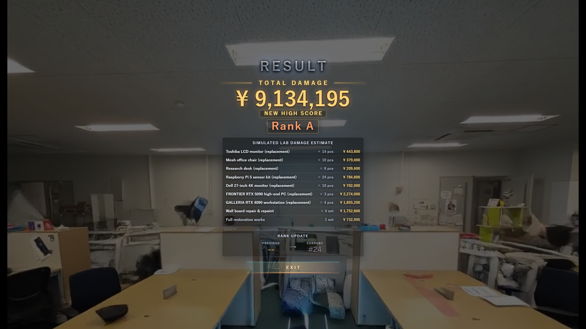
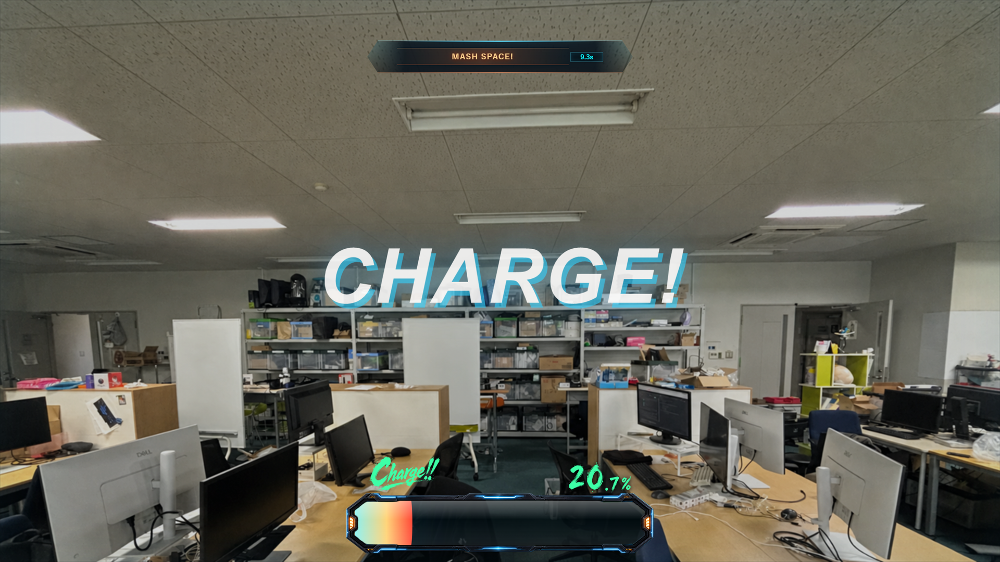

# 発勁ラボブレイカー

[](https://github.com/maaakigai/hakkei-lab-breaker-public/actions/workflows/ci.yml)

> mocopiを手首に装着し、「タメ」とパンチの勢いで研究室を破壊する体験型インスタレーション。

**完成・展示済み**　制作1か月 / 共同制作者2名＋生成AI支援 / メンター3名<br>
共同開発: [maaakigai](https://github.com/maaakigai) / [attack114514](https://github.com/attack114514)

画面内の英題`UBi-Lab Break Simulator`は、発勁ラボブレイカーの展示用タイトルです。



画面内のメーカー名・製品名は、研究室内に実在する備品を識別して架空の再調達見積を作るために表示しています。各メーカーを破壊対象とする意図、批判、提携・推奨を示すものではなく、金額もゲーム演出用のシミュレーションです。

## 作品概要

発勁ラボブレイカーは、Sonyのモーションセンサー「mocopi」1台を使ったElectron製のインタラクティブ映像作品です。Bluetooth Low Energy（BLE）で取得した手首の回転からタメ量とパンチ強度を推定し、威力に応じた破壊映像、推定損害額、ランク、ランキングを表示します。

参加者はスマートフォンでQRコードを読み取って名前を登録し、mocopiを装着してプレイします。実運用ではセルフホストのLinuxサーバー上に構築したPython製サーバーを使用し、展示機とHTTP / WebSocketで進行状況と結果を同期しました。同梱の提出版サーバーは展示当日の保存データを読み込まず、合成した初期ランキング10件から開始します。2026年7月25日に同実装を運用先へ反映し、公開HTTPS / WSSでQR登録からResult通知・ランキング更新までをCLIスモークテストで確認しました。翌26日には、スマートフォン実機でQRコードの読み取りと登録フローを確認しました。確認用データは削除し、合成初期データ10件だけの状態へ戻しています。スマートフォンとmocopiを組み合わせた実機完走は、ローカル実装・サーバー疎通とは分けた手動確認項目です。

## 展示実績

2026年7月12日、共同開発者が所属する研究室の発表会で1時間展示しました。正式な開始・終了時刻が残っていないため、参加者数とセッション数は展示日全体のサーバーログに基づく概算です。

| 項目 | 実績 |
|---|---|
| 制作期間 | 1か月 |
| 展示参加者 | 約30名 |
| 処理セッション | 約40セッション |
| 継続展示 | 1時間 |
| 観測された重大障害 | 0件 |
| QR登録・スコア連携 | セルフホスト型サーバーで実運用 |

展示日全体のログには準備・テストのセッションが含まれるため、人数とセッション数は概数として示しています。重大障害0件は当日の運用観察に基づき、ログだけから証明するものではありません。集計条件と証拠保全方法は[`docs/EXHIBITION_EVIDENCE.md`](docs/EXHIBITION_EVIDENCE.md)に記載しています。

## 体験の流れ

```text
QR登録 → 入力確認 → チャージ → パンチ
      → 破壊映像 → 損害額・ランク・ランキング
```

1. スマートフォンから名前を登録します。
2. 利き手にmocopiを装着し、接続状態を確認します。
3. 腕を動かしてチャージし、合図に合わせてパンチします。
4. 威力別の破壊映像と結果を展示機・スマートフォンに表示します。

## 画面遷移参考デモ

[](docs/media/keyboard-demo.mp4)

▶ [約35秒の画面遷移参考デモを再生する](docs/media/keyboard-demo.mp4)

この動画は実展示の録画ではなく、現行公開版を録画専用の`release_demo_qr.bat`で起動し、通信しないダミーQRを表示した登録画面から、キーボード予備入力によるチャージ、パンチ、破壊映像、初回順位更新を含むリザルトまでの導線を記録した参考映像です。登録名はキーボードで入力しています。ゲームの画面遷移はmocopi入力時と共通で、動画に音声トラックはありません。

## 制作体制と担当

本作品は、共同制作者2名が責任を持ち、CodexとClaudeを生成AIエージェントとして活用して開発しました。基本の流れは、Codexがマイルストーン案を作成し、Claudeがそれを修正し、両AIへ段階的に実装を依頼する形です。CodexとClaudeはTypeScript、Python、旧Unity期のC#を含むコード、テスト、文書を直接生成・修正しました。人間2名は変更内容に応じて差分、ログ、自動テスト、実機プレイ、目視確認を使い分け、共同でAI案の採用・修正・棄却、追加指示、統合、受入判断、リリース判断、展示運用を行いました。

以下の担当は、設計責任、AIへの指示、生成結果の採否・修正、検証、統合を含む主担当を示します。ファイルの全行を本人だけが手入力したという意味ではありません。3名のメンターからは、設計とmocopi 1台化方針について助言を受けました。

### [maaakigai](https://github.com/maaakigai)

- システム全体の初期設計と、装着後に展示機へ戻る動作や名前の再入力を減らすスマートフォン中心の体験導線を設計。
- QRプレイヤー登録、スマートフォン操作、スコア・ランキング、WebSocket切断時のHTTP代替通信、サーバー停止時のローカル継続を中心に実装。
- Linux / systemdへのデプロイ、ドメイン設定、Cloudflare TunnelによるHTTPS/WSS公開、会場ネットワーク、サーバーログ、バックアップ、監視、復旧手順を整備。
- 動画・音響素材のゲーム内配置を中心に担当し、展示用SFXの切り出し、ループ、再生タイミングを調整。結果画面とUIは2名で同程度に共同制作。

### [attack114514](https://github.com/attack114514)

- 初期設計を基にMVPとゲーム操作部分を実装。
- メンターの助言を受けてmocopi 1台で動作する構成へ改良し、BLEパケット解析、Python補助プロセス、姿勢データから角速度への変換を実装。
- mocopi BLE入力とスコア設計を中心に担当。結果画面とUIは2名で同程度に共同制作。
- `Wan-AI/Wan2.2-I2V-A14B`の生成操作、プロンプト、シード値の設定を担当し、生成出力の採用は2名で共同判断。
- 展示会場の設営と参加者対応を担当。

### 共同で行ったこと

スケジュールと仕様を共同管理し、mocopiを所持している側が実機依存の作業を進めました。結果画面、UI、Wan生成出力の選定は共同で進め、互いに気づいた箇所を改善し、AI出力の評価、レビュー、統合も共同で行いました。

代表的な設計変更として、当初のスマートフォン同期はRESTポーリング中心でしたが、maaakigaiが画面遷移時の不安定化を懸念し、実機確認でも不安定な挙動を観測しました。maaakigaiがWebSocketによるサーバープッシュ優先方式への変更を提案し、AIエージェントへ再実装を指示しました。初期同期と障害時のRESTフォールバックは残し、変更後は2名で受入確認を行い、展示中にも同現象は観測されませんでした。

スマートフォンUIのAI初期案では、同じ視覚的優先度のボタンが多数並び、画面遷移ごとにメイン画面へ操作が追加される構成でした。maaakigaiは判断の遅れと誤操作につながると考え、使用頻度の低い操作を`OPTION`へ集約し、追加操作を必要な場面だけ開く階層化ダイアログへ移しました。主要導線では、参加者がその時点で最も目立つボタンを順に操作するだけで進める構成にしています。

ファイル・モジュール単位の主担当は[`docs/CONTRIBUTIONS.md`](docs/CONTRIBUTIONS.md)に整理しています。
開発の進め方と生成AIの利用範囲は[`docs/DEVELOPMENT_PROCESS.md`](docs/DEVELOPMENT_PROCESS.md)に整理しています。

## 技術的な特徴

| 展示で想定した課題 | 設計・実装 |
|---|---|
| センサー値の欠落やノイズ | 受信頻度、タイムアウト、欠落、静止時ノイズをMain Processで監視し、無効な入力をスコアから除外 |
| 入力方式ごとの実装差 | mocopi BLE、録画再生、キーボードを共通の`PunchInputSample`へ変換 |
| 通信障害時の展示停止 | ローカル継続モード、ローカルランキング、キーボード予備入力を用意 |
| 会場ごとの判定・演出調整 | 判定値、スコア、ランク、動画レベル、音量を`config/*.json`へ集約 |
| 描画プロセスの権限肥大化 | Main / Preload / Rendererを分離し、`contextIsolation`とsandboxを有効化。限定したAPIだけを`contextBridge`で公開 |

## mocopi 1台を主入力にした仕組み

現行の主入力では、公式アプリやUnity Bridgeを介さず、手首に装着したmocopi 1台へWindowsパソコンからBLE通信で直接接続します。

```text
mocopiの姿勢データ（約50Hz）
  → Python補助プロセスで受信・解析
  → Electron Mainで角速度と入力品質を算出
  → チャージ量・パンチ強度としてゲームへ反映
```

- バイナリパケットから手首の姿勢を表すクォータニオン（四元数）を読み取ります。暗号の復号ではなく、実機検証に基づくバイナリ解析です。
- 連続する姿勢の回転差を時間で割り、角速度（angular velocity）へ変換します。
- 角速度の積算値をチャージ量、瞬間的なピークをパンチ強度の指標として使用します。

パケット内の加速度らしき値は実機で動きに反応せず、入力には採用しませんでした。一方、静止時とパンチ時の角速度には最大値で約400倍の差があり、1台でも強弱判定に使えることを確認しました。

角速度は物理的な打撃力や手の直線速度そのものではなく、パンチの勢いをゲーム入力へ変換するための指標です。実測と判断の詳細は[`mocopi BLE信号の実機検証`](docs/technical-notes/mocopi-ble-signal-validation.md)にまとめています。

## Critical演出

通常の威力判定に加え、Participant Assistはmocopi入力時のチャージ成立基準を下げ、動作確認用のforced CriticalはCriticalを確実に発生させます。Criticalでは大型電波塔の破壊映像と650億円のボーナスを結果演出へ加えます。ランキング順位の比較に使うのはボーナス加算前のbase scoreだけで、Criticalボーナスによって順位が変わることはありません。

通常Lvの研究室破壊映像は元の研究室写真を入力にしたWan2.2 I2V、Critical専用の大型電波塔映像はGeminiを用いて制作しました。どちらも公開版では無音です。

## QR登録とスコア管理

展示機が発行するセッション別QRコードをスマートフォンで読み取ると、参加者は名前を登録してゲームへ参加できます。登録後の入力待機、準備完了、結果表示までをスマートフォンと展示機で同期します。展示機で名前を直接入力する経路も同じ共有ランキングへ記録され、スマートフォンへの進行通知だけを省略します。

- スマートフォンから受け取る情報を、プレイヤー情報と操作状態に限定。
- スコアは展示機側で計算し、確定した結果だけをサーバーへ送信。
- QRにはセッションIDだけを含め、展示機だけが保持する短期game tokenでゲーム側の状態変更と結果送信を認証。
- QRサーバーは、登録日時・最終プレイ日時と未プレイを含む登録名候補を配信し、展示機間で表示と候補を統一。
- QRサーバーはプレイヤーIDごとのハイスコア、プレイ回数、最終プレイ時刻を管理。
- ランキングはサーバーを正本として展示機へ配信し、通信不能時はローカル継続モードへ切り替え。

`release.bat`は設定された共有サーバーへ接続し、実際のQR登録とランキング更新を行います。同梱の提出版サーバー実装は展示当日のニックネーム、スコア、セッション履歴を読み込まず、`PLAYER 001`等の合成初期データ10件から開始します。提出版サーバーを運用先へ反映した後に新規登録・送信された結果は、通常のランキングデータとして永続保存します。

QRとスマートフォン操作は従来どおりセッションIDだけで動作します。展示機はQR表示前に短期game tokenをサーバーへ登録し、ゲーム側の状態変更、スコア確定、結果公開だけを認証します。tokenはQRやスマートフォンへ渡しません。管理用HTTP APIは公開せず、運用者がSSHでサーバーへ入って`manage.py`を直接実行します。イベントログもサーバー内にだけ保存し、公開APIやこのリポジトリからは取得できません。リポジトリには運用中のユーザー情報、個別スコア、セッション履歴、SSH資格情報を収録していません。

## アーキテクチャ

| 経路 | データの流れ |
|---|---|
| 主入力 | mocopi 1台 → BLE通信 → Python補助プロセス → ローカルUDP → Electron Main |
| 予備入力 | キーボード → Electron Main |
| 登録・スコア | スマートフォン ↔ Pythonスコアサーバー ↔ Electron Main |
| ゲーム処理 | Electron Main → Electron Renderer → 破壊映像・損害額・ランク |

旧Unity Bridge経路は、入力方式を比較・検証するための開発資産として残しています。

## 技術スタック

| 領域 | 技術 |
|---|---|
| デスクトップアプリ | Electron 43 / TypeScript 5.9 / HTML / CSS |
| ビルド | esbuild / Node.js 22.13+ |
| モーション入力 | mocopi BLE / Python補助プロセス / ローカルUDP |
| ユーザー・スコア管理 | Python / aiohttp / WebSocket |
| 旧入力経路 | Unity / C# / mocopi Receiver Plugin |
| テスト | Node.js test runner / ESLint / TypeScript |

## ローカルで試す

Node.js 22.13以上とnpmが必要です。mocopiがなくてもキーボード予備入力で体験できます。

```bash
npm ci
npm run dev -- --local-mode
```

1. タイトル画面で`START GAME`を選び、名前登録を済ませてInputCheckへ進みます。
2. InputCheck画面右下の`[ K ] KEYBOARD MODE`をクリックするか、`K`キーを押します。タイトル画面で先に切り替える場合は、`S`キーで`INPUT SETTINGS`を開きます。
3. `PROCEED`を選び、キーボード予備入力でゲームを進めます。

| キー | 動作 |
|---|---|
| `S` | タイトル画面で入力設定を開く |
| `K` / `M` | InputCheckでキーボード / mocopi入力へ切り替える |
| `Space` | チャージ中にタメを増やす |
| `Enter` | 発勁待機中にパンチ |
| `R` | 入力確認画面へリセット |
| `Esc` | タイトル画面へ戻る |

詳しい操作、mocopiの接続方法、診断表示は[`docs/CURRENT_USAGE_JA.md`](docs/CURRENT_USAGE_JA.md)を参照してください。

### Windows用ショートカット

コマンド入力なしで起動・設定できるバッチファイルも`scripts/windows/`に残しています。

| ファイル | 用途 |
|---|---|
| [`release.bat`](scripts/windows/release.bat) | QR登録を含む通常の展示用起動 |
| [`release_demo_qr.bat`](scripts/windows/release_demo_qr.bat) | 通信しないダミーQRを表示する録画専用起動 |
| [`release_local.bat`](scripts/windows/release_local.bat) | サーバー停止時のローカル継続起動 |
| [`Settings.bat`](scripts/windows/Settings.bat) | スコア・音量などの設定画面 |
| [`run-dev.bat`](scripts/windows/run-dev.bat) | 開発用起動 |
| [`debug.bat`](scripts/windows/debug.bat) | 診断表示つき起動 |
| [`MocopiKeyboardEmulator.bat`](scripts/windows/MocopiKeyboardEmulator.bat) | mocopiキー入力エミュレーター |

`release_demo_qr.bat`は映像収録専用です。登録画面に`DEMO QR — RECORDING ONLY`と`https://example.invalid/hakkei-demo`の無効なQRを表示し、公開サーバーへ通信しません。名前はキーボードで入力します。実際のQR登録やサーバー接続の確認には`release.bat`を使用してください。

同梱の提出版サーバー実装には管理用HTTP APIがありません。管理確認や削除が必要な場合は、運用者がSSH接続後にサーバー内の`manage.py`を直接実行します。QRには認証情報を含めず、ゲーム専用tokenもサーバーにはハッシュだけを保存します。

<details>
<summary>ローカルスコアサーバーも試す</summary>

通常起動は共有QRサーバーへ接続します。ローカル確認用のサーバープログラムは[`CloudServer/hakkei-score-server/`](CloudServer/hakkei-score-server/)として同梱しています。PC内で独立したサーバーを試す場合は次を起動し、`config/app.config.json`の`remoteSession.httpBaseUrl`と`wsUrl`をローカル接続先へ変更してください。

```bash
cd CloudServer/hakkei-score-server
python -m venv .venv
# Windows PowerShell: .\.venv\Scripts\Activate.ps1
pip install -r requirements.txt
python server.py
```

同梱サーバーの接続先は`http://127.0.0.1:45200`、`ws://127.0.0.1:45200/ws`です。スマートフォンから使う場合は、端末から到達できるHTTPS/WSSの公開経路が必要です。リバースプロキシまたはトンネルを利用でき、実運用ではCloudflare Tunnelを使用しました。

ローカル起動時の実行時データは既定で`data/submission-runtime/`へ保存され、公開用の合成初期データを置く`data/`直下とは分離されます。Internetへ接続する運用では、旧展示データとは別に権限を制限したディレクトリを作り、systemdと`manage.py`へ同一の`HAKKEI_DATA_DIR`を明示してください。

サーバーの役割、実行時データ、主なAPI、公開運用時の注意は[`CloudServer/hakkei-score-server/README.md`](CloudServer/hakkei-score-server/README.md)にまとめています。

</details>

## 品質確認

pushとpull requestでは[GitHub Actions](https://github.com/maaakigai/hakkei-lab-breaker-public/actions/workflows/ci.yml)が次を自動実行します。

```bash
npm run typecheck
npm run lint
npm test
npm run build
cd CloudServer/hakkei-score-server
python -m unittest -v test_server.py
```

Electron実起動、mocopi実機、展示ネットワーク、連続プレイはCIでは再現せず、[`HUMAN_TEST_GUIDE_JA.md`](HUMAN_TEST_GUIDE_JA.md)に沿って手動確認します。主な自動テスト対象は設定検証、UDP受信、入力データ生成、フィルター、状態遷移、スコア、発勁判定、ランキング、動画選択、公開用音声・動画assetです。

Electronの権限分離とsandbox設定の意図は[`docs/architecture/electron-security.md`](docs/architecture/electron-security.md)に記録しています。

2026年7月26日の提出前ローカル確認では、Node.js自動テスト304件、Pythonサーバーテスト18件、型検査、静的解析、クリーンビルド、公開素材検査、`npm audit --audit-level=high`を通過しました。デモQRモードのローカルElectronアプリを実起動し、名前登録、キーボードモードへの切替、Charge、破壊映像、Result、タイトル復帰まで完走しています。運用先では、公開HTTPS / WSSでQR登録、READY、入力準備、プレイ開始、Result通知、ランキング登録、Result終了までをCLIから確認し、スマートフォン実機でもQRコードの読み取りと登録フローを確認しました。確認用データは削除済みです。mocopiとスマートフォンを組み合わせた実機完走は手動確認項目です。展示用音声は公開版に含まないため、音量バランスは公開版の確認対象外です。

最終監査で採用した判断と確認結果は[`docs/runs/20260725-submission-final-audit.md`](docs/runs/20260725-submission-final-audit.md)に記録しています。

<details>
<summary>ディレクトリ構成を見る</summary>

```text
src/              Electronアプリ本体
config/           入力、スコア、演出の設定
CloudServer/      登録・ランキングサーバー
assets/           映像・静止画・生成プレースホルダー音声
scripts/          ビルド、モック、Windows起動スクリプト
tools/            mocopi BLE補助プロセス・調査ツール
test/             自動テスト
docs/             仕様、検証記録、運用手順、開発資料
unity-bridge/     旧Unity入力経路と検証資産
```

</details>

## 公開版について

このリポジトリは、実装と設計判断を閲覧できるポートフォリオ用スナップショットです。開発元リポジトリは非公開のためリンクしていません。

### 展示版との差分

公開版には、通常Lvの研究室破壊に加え、Critical時の大型電波塔映像と650億円ボーナス、展示補助用Assist、動作確認用forced Criticalを含めています。ランキングはCriticalボーナスを除いたbase scoreだけで比較します。展示会場だけで使用した人物画像や専用音声は収録していません。

展示時は当時の会場と利用条件に照らして運用しました。インターネット公開では第三者が継続的に閲覧・複製できるため、公開・再配布条件を明示できる素材へ整理し、展示専用の人物画像・音声を除外しました。

- 展示当日の実ユーザー、ランキング、セッションの保存データは、リポジトリにも提出版サーバー用の合成初期データにも含めません。元データはアクセス制限した非公開スナップショットとして保全し、公開資料には集計値とSHA-256だけを記載しています。
- `release.bat`は既定でHTTPS/WSS接続、QR登録、状態同期、ランキング更新を有効にします。同梱の提出版サーバーは旧展示データと別の新規`HAKKEI_DATA_DIR`で合成初期データ10件から開始し、その後の新規登録・結果を永続保存します。QRはセッションIDだけを含み、ゲーム側の変更は展示機だけが保持する短期tokenで認証します。管理用HTTP APIはなく、管理はSSH接続後に同じ`HAKKEI_DATA_DIR`を指定した`manage.py`で行います。イベントログもサーバー内にだけ保存します。2026年7月26日に運用先へ反映し、公開HTTPS/WSS、旧直接スコアAPIの404、未認証ゲーム変更の403をCLIで確認済みです。スマートフォンとmocopiを使う実機完走は`release.bat`で手動確認します。
- `release_local.bat`は外部サーバーへ接続せず、キーボード名前入力とローカルランキングで継続するオフライン経路です。
- SSH情報、TLS・トンネル・サービス設定などの非公開な運用資格情報は含みません。
- 公開される音声はすべて無音です。`assets/Sound/`以下のBGM・SFXはPCMサンプルがすべて0の完全な無音WAVで、公開MP4には音声トラックがありません。
- 通常Lvの研究室破壊映像は、共同制作者が撮影した元の研究室写真を入力に、無改変の公式`Wan-AI/Wan2.2-I2V-A14B`チェックポイントをローカル環境で使用し、2026年7月5日にプロンプトとシード値を固定して生成した1280×720のI2V映像です。Critical専用の大型電波塔映像にはGeminiを使用しました。
- `assets/images/lab-backgrounds/lab-main-front-16x9.png`は、共同制作者が撮影した元の研究室写真を16:9・1280×720へ合わせたゲーム背景です。撮影者の同意は、ゲーム内利用、Wan I2Vへの入力、生成映像を含むGitHub公開・採用応募利用を含みます。
- 映像・静止画に付随して写るロゴと、損害見積に表示するメーカー名・製品名は研究室備品の識別に限って使用し、権利者による提携・推奨を示しません。
- 開発時の判断根拠、検証記録、手動確認手順は`docs/`に残しています。

素材の権利・出典は[`ASSET_LICENSES.md`](ASSET_LICENSES.md)、第三者コードは[`THIRD_PARTY_NOTICES.md`](THIRD_PARTY_NOTICES.md)、公開条件は[`NOTICE.md`](NOTICE.md)に整理しています。
