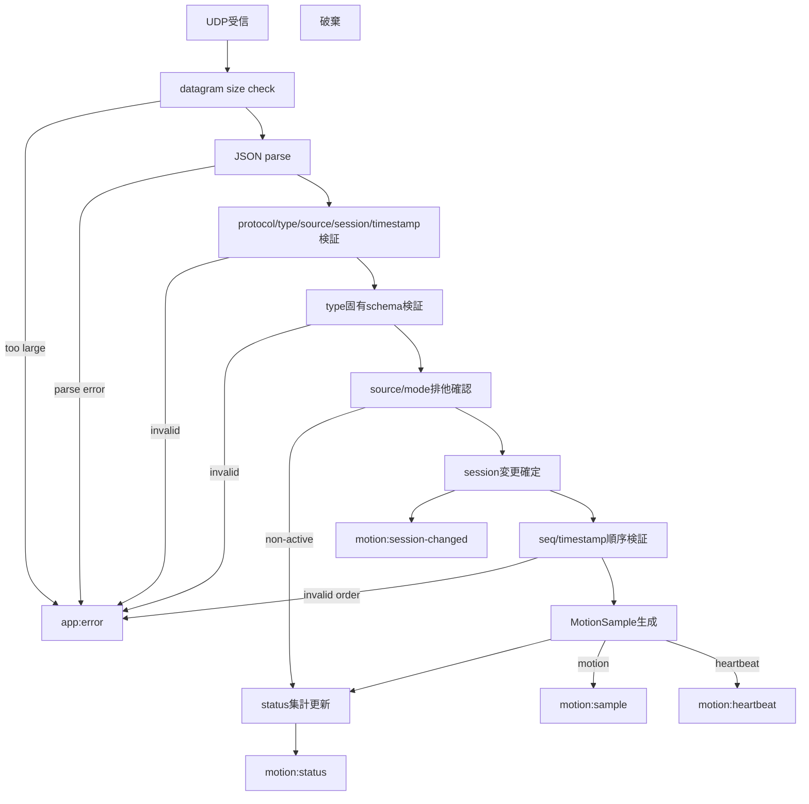
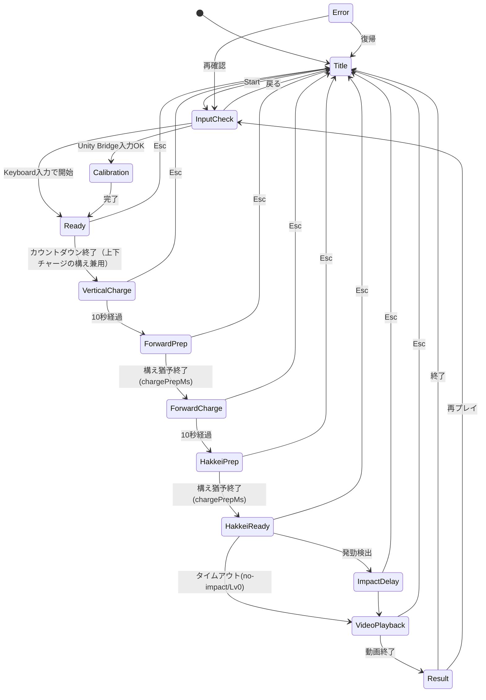
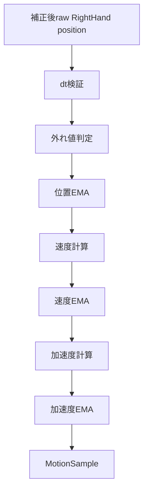

# SPEC.md

> 🚧 **過渡期 status（2026-06-27）**: 方針が **mocopi app/Unity 廃止 → BLE 直読 1 センサー・方向廃止・パンチ強度のみ（magnitude-only）** へ転換中。
> 新方針の骨組み下書きは [docs/drafts/SPEC-v2-ble-magnitude.md](docs/drafts/SPEC-v2-ble-magnitude.md) / [MILESTONES-v2](docs/drafts/MILESTONES-v2-ble.md) / [GATES-v2](docs/drafts/GATES-v2-ble.md)。
> **BLE probe スパイク（`tools/mocopi_ble_probe.py`）が GO したら**、本書を v2 で権威化し旧本文を `docs/legacy/` へ退避する（Codex docs-remake review 2026-06-26）。
> それまでは本書（§0.24 以前）が現行権威だが、Unity/6センサー/方向/§0.23 系の記述は**順次 supersede 予定**。

発勁ラボブレイカーの実装仕様書です。要件定義書を、実装・テスト・レビューで使いやすい形に再構成しています。

この文書は `docs/requirements.md` の固定前提に従います。`docs/requirements.md` が存在しないリポジトリ状態では、仕様判断の根拠が欠けるため、まず `docs/requirements.md` を配置してください。

レビュー履歴は `docs/archive/reviews/DOC_REVIEW_ALL_FINDINGS_RESOLUTION_REPORT.md` を参照します。添付レビュー原本の `DOC_REVIEW_ALL_FINDINGS.md` は入力資料であり、リポジトリに常置しない場合でも、対応結果はResolution Reportへ残します。


## 0. 2026-06-06 確定実装契約

この章は `docs/archive/reviews/UNRESOLVED_ISSUES_CURRENT.md` の対象内指摘を検証して確定した実装契約です。既存章とこの章が衝突する場合は、この章を優先します。対象は、実装、型、IPC、validator、状態遷移、Calibration、score、動画、Gate技術判定、テスト契約に限ります。会場運用、安全誘導、配布・署名・ビルド配布手順はこの章では扱いません。

### 0.1 責務分担

| 領域 | 確定責務 |
|---|---|
| Electron Main | UDP受信、JSON validator、source/session管理、座標補正、filter、速度、加速度、`MotionSample` 生成、`validForScore` / `validForCalibration` 算出、status/diagnosticsのMain由来値生成 |
| Preload | 型付きIPC APIだけを `window.hakkeiLabBreaker` として公開し、購読APIは必ず `Unsubscribe` を返す |
| Electron Renderer | `MotionSample` を消費して状態遷移、Calibrationのphase制御、score、Hakkei判定、動画、Result、UIを進める。速度・加速度・filter・validityは再計算しない |
| Unity Bridge | Receiver Pluginで受けたAvatar反映後のRightHand Transformを読み、v1 motion/heartbeat JSONを送信する。score、動画、Result、状態管理は持たない |

KeyboardとMock Unity BridgeもMainで `MotionSample` に正規化します。RendererからKeyboardの疑似座標を直接scoreへ入れてはいけません。

### 0.2 入力sourceとmodeの排他

| activeMode | scoreへ流してよいsource | 備考 |
|---|---|---|
| `none` | なし | 起動直後、Title、明示停止中だけ |
| `keyboard` | `keyboard` | MainのKeyboard generatorがsampleを生成する |
| `mock-unity-bridge` | `mock-unity-bridge` | Mock確認専用。Unity実入力のGate B2/D1を通した扱いにしない |
| `unity-bridge` | `unity-bridge` | 実Unity Bridge確認専用 |

非active sourceのpacketは、`sourceStatuses` とwarning countには反映してよいが、`motion:sample` と通常scoreには流しません。active sourceとpacket sourceが異なるpacketをscore経路へ流そうとした場合は `SOURCE_MISMATCH` です。

### 0.3 v1 packet契約

`BridgePacketBaseV1` の共通fieldは、type固有検証より前に検証します。共通fieldが不正なpacketでsession resetを起こしてはいけません。

```ts
export type BridgePacketSource = "unity-bridge" | "mock-unity-bridge";

export type BridgePacketBaseV1 = {
  protocolVersion: 1;
  type: "motion" | "heartbeat";
  sessionId: string;
  timestampMs: number;
  source: BridgePacketSource;
};
```

| field | 条件 |
|---|---|
| `protocolVersion` | 数値 `1` または `2`（移行期間・§7.4.1 参照）。それ以外は `INVALID_PACKET_BASE` |
| `type` | `motion` / `heartbeat` のみ。その他は `UNKNOWN_PACKET_TYPE` |
| `source` | `unity-bridge` / `mock-unity-bridge` のみ |
| `sessionId` | 1〜64文字、ASCII可視文字、`[A-Za-z0-9._:-]`。受信時にtrimや大小変換をしない |
| `timestampMs` | 0以上のsafe integer。同一 `source + remoteAddress + sessionId + type` で単調増加 |

session変更は、packet共通fieldとtype固有schemaが有効であることを確認した後に確定します。不正packetで `motion:session-changed` を発火させません。

### 0.4 motion JSONとRightHand欠損

`rightHand` は、`isTracked=true` かつ `avatar.isHuman=true` かつ `avatar.hasRightHand=true` のとき必須です。いずれかがfalseの場合は、`rightHand` を省略または `null` にできます。そのpacketはschema validですが、Mainは `isAvailable=false`、`validForScore=false`、`validForCalibration=false` の `MotionSample` を生成します。

```ts
export type UnityMotionPacketV1 = BridgePacketBaseV1 & {
  type: "motion";
  seq: number;
  isTracked: boolean;
  rightHand?: Vec3 | null;
  avatar: {
    isHuman: boolean;
    hasRightHand: boolean;
    forward?: Vec3 | null;
  };
};
```

unavailable sampleの座標は次で固定します。

| 状態 | `rawHandPosition` | `handPosition` | `velocity` / `acceleration` | flags |
|---|---|---|---|---|
| 直前有効sampleあり | 直前有効raw値 | 直前有効filtered値 | 0 | `NOT_TRACKED` / `AVATAR_NOT_READY` / `RIGHT_HAND_UNAVAILABLE` |
| 直前有効sampleなし | `{0,0,0}` | `{0,0,0}` | 0 | 上記 + `DT_RESET` |

復帰後の最初のvalid sampleはbaseline更新だけに使い、score/hakkeiには使いません。`RECOVERED_FROM_UNAVAILABLE` と `DT_RESET` を付けます。

### 0.5 seq / timestamp / source identity

| 条件 | 処理 |
|---|---|
| `seq` 欠損・非safe integer | `INVALID_MOTION_PACKET`。sampleは生成しない |
| `seq < previousSeq` | `SEQ_ROLLBACK`。sampleは生成しない |
| `seq === previousSeq` | `SEQ_DUPLICATE`。sampleは生成しない |
| `seq > previousSeq + 1` | packetは受理し、`SEQ_GAP` warningと欠落推定数を加算 |
| `timestampMs <= previousTimestampMs` | `TIMESTAMP_ROLLBACK`。sampleは生成しない |
| `timestampMs - previousTimestampMs > maxDtMs` | sampleは生成するが `validForScore=false`、`validForCalibration=false`、`DT_TOO_LARGE` / `TIMESTAMP_GAP` を付ける |

送信元identityは `source + remoteAddress` です。`remotePort` と `sessionId` はidentityに含めません。同一sourceでheartbeat timeout未満の複数identityが同時に動いた場合だけ `DUPLICATE_SOURCE` を出します。

### 0.6 filter / dt / outlier処理

`MotionSample` は異常sampleを完全に隠さず、diagnosticsとGate判定で観測できる形にします。ただしscore/hakkeiへは入れません。

| 条件 | sample生成 | `isAvailable` | `validForScore` | 座標・速度の扱い |
|---|---:|---:|---:|---|
| schema invalid / common invalid | なし | - | - | packet破棄 |
| `DT_TOO_SMALL` | あり | true | false | 直前filtered座標を保持。速度・加速度0 |
| `DT_TOO_LARGE` / `TIMESTAMP_GAP` | あり | true | false | 現在rawでfilterをreset。速度・加速度0 |
| position jump外れ値 | あり | true | false | 直前filtered座標を保持 |
| velocity外れ値 | あり | true | false | 速度・加速度0。baseline reset |
| acceleration外れ値 | あり | true | false | 加速度はdiagnostic用にclampしても、scoreには使わない |
| unavailable | あり | false | false | 直前有効値または0を保持 |
| 正常 | あり | true | true | 補正後raw、filtered、速度、加速度を出力 |

`dtMs` を式で使う場合は必ず秒へ変換します。

\[
 dtSec = dtMs / 1000
\]

EMAはHz依存を避けるため、configのalphaを基準Hzに対するalphaとして扱い、実dtへ変換します。

\[
 lpha_{effective} = 1 - (1 - lpha_{reference})^{dtMs / referenceDtMs}
\]

### 0.7 座標補正

`rawHandPosition` はUnity座標をそのまま入れるのではなく、`input.config.json.coordinates` の `axisMap`、`sign`、`scaleMultiplier`、`offset` 適用後、filter前の座標です。範囲validatorも補正後座標に対して行います。

```ts
export type AxisName = "x" | "y" | "z";
export type CoordinateConfig = {
  axisMap: { x: AxisName; y: AxisName; z: AxisName };
  sign: { x: 1 | -1; y: 1 | -1; z: 1 | -1 };
  scaleMultiplier: number;
  offset: Vec3;
  defaultUpVector: Vec3;
  defaultForwardVector: Vec3;
  coordinateWarnAbsM: number;
  coordinateInvalidAbsM: number;
};
```

`upVector` と `forwardVector` は補正後座標系で正規化します。優先順位は、Calibrationの前方動作から得たvector、Unity packetの `avatar.forward`、configの `defaultForwardVector` の順です。いずれも長さが0または非有限ならCalibration失敗にします。

### 0.8 MotionSample型

> **※ §0.23（2026-06-25）優先。** 下の `PhaseName` は旧 3段階モデルの値。単手モデルでは `vertical-charge`/`forward-charge` を `charge`/`hakkei-prep` 等へ rename し、trigger/outcome を追加する（実装時に更新）。

```ts
export type MotionSource = "unity-bridge" | "mock-unity-bridge" | "keyboard";
export type PhaseName = "input-check" | "neutral" | "forward" | "vertical-charge" | "forward-charge" | "hakkei-ready";

export type MotionQualityFlag =
  | "DT_RESET"
  | "DT_TOO_SMALL"
  | "DT_TOO_LARGE"
  | "SEQ_GAP"
  | "TIMESTAMP_GAP"
  | "NOT_TRACKED"
  | "AVATAR_NOT_READY"
  | "RIGHT_HAND_UNAVAILABLE"
  | "COORDINATE_RANGE_WARN"
  | "OUTLIER_POSITION_JUMP"
  | "OUTLIER_VELOCITY"
  | "OUTLIER_ACCELERATION"
  | "RECOVERED_FROM_UNAVAILABLE"
  | "LOW_SAMPLE_RATE";

export type MotionSample = {
  protocolVersion: 1;
  source: MotionSource;
  sessionId: string;
  seq: number;
  timestampMs: number;
  receivedAtMs: number;
  rawHandPosition: Vec3;
  handPosition: Vec3;
  velocity: Vec3;
  acceleration: Vec3;
  isAvailable: boolean;
  validForScore: boolean;
  validForCalibration: boolean;
  quality: {
    dtMs: number;
    sampleRateHz: number;
    isFiltered: boolean;
    droppedFrameCount: number;
    invalidPacketCount: number;
    flags: MotionQualityFlag[];
  };
};
```

`quality.sampleRateHz` は直近1000msの生成sample数から算出します。LOW_SAMPLE_RATE判定は1000ms window、入力mode変更後1000msのgrace、thresholdは `lowSampleRateHz` です。


### 0.8.1 Keyboard generator契約

`activeMode="keyboard"` の間、Mainの `keyboardSampleGenerator` は60Hzで常時tickし、キー入力がない間もidle sampleを送ります。idle sampleの移動量は0なので、charge中にscoreは増えませんが、InputCheckの `motionHz`、`isReceiving`、dt表示は安定します。

| 状態 | generator | 備考 |
|---|---|---|
| `none` / 非keyboard mode | 停止 | pressed stateを破棄する |
| `keyboard` + Title/InputCheck/Ready/charge/HakkeiReady | 60Hz tick | idle sampleも送る |
| Result | 停止可 | replay時に新sessionを作る |
| Error | 停止可 | error-recovery時に新sessionを作る |

Space（四十肩アクセシビリティ・2026-06-24変更）は**連打で右手チャージ**します．KeyL は左手チャージに使います．1タップ（押下エッジ）ごとに疑似的な手の目標が `±(tapVerticalStepM, tapForwardStepM)` へ交互に反転し，`tapSpeedMps` で寄っていく往復運動になります．これにより上下/前後どちらのチャージフェーズでも，M11の変位積分（`upVector`/`forwardVector` 射影）で溜まります．OSキーリピート（長押し）は押下エッジを増やさないため反転せず，静止に収束して溜まりません．A/Dは廃止です．Enterは `enterDurationMs` 内に左右両手を `enterForwardDisplacementM` だけ前方へ進めるease-out波形を生成します．初期値は `0.30m / 200ms` とし，平均速度が `hakkeiMinForwardVelocity=1.2m/s` を上回るようにします．Enterで状態遷移を直接起こしてはいけません．

### 0.9 IPC型と命名規則

Main → Renderer eventは `domain:event-name` 形式、Renderer → Main commandは `domain:action:name` 形式を使います。したがって `app:error-clear` はevent、`app:error:clear` はcommandとして併存させます。混同を避けるため、preload API名は `onAppErrorClear` と `clearAppError` で分けます。

`IpcResult<void>` の成功形は `{ ok: true }` です。

```ts
export type IpcSuccess<T = void> = [T] extends [void] ? { ok: true } : { ok: true; value: T };
export type IpcFailure = { ok: false; code: AppErrorCode | "MODE_UNAVAILABLE" | "INVALID_REQUEST"; messageJa: string };
export type IpcResult<T = void> = IpcSuccess<T> | IpcFailure;
```

`config:get` はconfig invalid時も型付きで返せるよう、responseを `IpcResult<AppConfigBundle>` にします。アプリ起動時にconfigがfatal invalidの場合はRenderer起動後にError画面へ遷移させます。

### 0.10 status / diagnostics payload

parse前でsourceが分からないpacketは `globalInvalidPacketCount` に加算します。`sourceStatuses` に型外の `unknown` keyを混ぜません。

```ts
export type MotionStatusPayload = {
  activeMode: InputMode;
  generatedAtMs: number;
  globalInvalidPacketCount: number;
  sourceStatuses: Record<MotionSource, SourceStatusSnapshot>;
  activeWarnings: StatusWarning[];
  activeErrors: AppErrorCode[];
};

export type MotionDiagnosticsPayload = {
  activeMode: InputMode;
  source: MotionSource | null;
  sessionId: string | null;
  generatedAtMs: number;
  windows: {
    motionHzWindowMs: number;
    jitterWindowMs: 2000;
    hakkeiStaticWindowMs: 10000;
  };
  rawJitterRms2s: number | null;
  rawMaxJitter2s: number | null;
  rawDrift2s: number | null;
  filteredJitterRms2s: number | null;
  filteredMaxJitter2s: number | null;
  filteredDrift2s: number | null;
  validSampleRatio: number | null;
  validSampleRatioByPhase: Partial<Record<PhaseName, number>>;
};
```

`motion:status` はpacket受信時だけでなく、250ms周期でも再発行します。これによりtimeout、ageMs、Error clearをpacket停止中でも表示できます。`motion:diagnostics` はInputCheck/Calibration/charge中は500ms周期、Result/Titleでは停止してよいです。

### 0.11 StatusWarning固定表

| code | messageJa | scope | 発火条件 | clear条件 | count |
|---|---|---|---|---|---:|
| `UNKNOWN_FIELDS` | 未知の項目を受信しました | source + sessionId + type + fieldPath | unknown field初回検出 | session変更 | 初回のみ+1 |
| `SEQ_GAP` | motion seqに欠落があります | source + sessionId | `seq > previousSeq + 1` | session変更 | 欠落推定数 |
| `TIMESTAMP_GAP` | 入力timestampに大きな間隔があります | source + sessionId + type | `dtMs > maxDtMs` | 正常sample 1秒継続 | +1 |
| `LOW_SAMPLE_RATE` | 入力頻度が低下しています | source | motionHz < lowSampleRateHz | 閾値以上が1秒継続 | window中1回 |
| `HEARTBEAT_TIMEOUT` | heartbeatが途切れています | source | lastHeartbeat age >= heartbeatTimeoutMs | heartbeat復帰 | timeout遷移時+1 |
| `MOTION_TIMEOUT` | motionが途切れています | source | lastMotion age >= motionTimeoutMs | motion復帰 | timeout遷移時+1 |
| `AVATAR_NOT_READY` | アバターが準備できていません | source + sessionId | heartbeat/avatar.isHuman false | true復帰 | 状態変化時+1 |
| `RIGHT_HAND_UNAVAILABLE` | 右手ボーンが取得できません | source + sessionId | rightHandReady/hasRightHand false | true復帰 | 状態変化時+1 |
| `NOT_TRACKED` | 右手トラッキングが外れています | source + sessionId | isTracked false | true復帰 | 状態変化時+1 |
| `COORDINATE_RANGE_WARN` | 座標が想定範囲外です | source + sessionId | 補正後座標abs > warn | 1秒正常 | +1 |
| `DUPLICATE_SOURCE` | 同じsourceの送信元が複数あります | source | 複数identityが同時active | 片方timeout | 状態変化時+1 |
| `NON_ACTIVE_SOURCE_PACKET` | 非選択sourceのpacketを受信しました | source | active sourceではないpacket | mode変更 | window中1回 |
| `RECOVERED_FROM_UNAVAILABLE` | 入力が復帰しました | source + sessionId | unavailable後の初回valid | 次sample | +1 |
| `JITTER_WARN` | 静止時の揺れが大きいです | source + sessionId | jitter WARN以上 | 2秒PASS | 状態変化時+1 |

### 0.12 Error code追加・severity方針

`AppErrorCode` には既存値に加えて、`INVALID_PACKET_BASE`、`SEQ_DUPLICATE`、`MOTION_TIMEOUT`、`HEARTBEAT_TIMEOUT`、`MODE_UNAVAILABLE`、`INVALID_REQUEST` を実装上の固定codeとして扱います。

| severity | 画面遷移 |
|---|---|
| `warning` | 基本は現在画面を維持し、InputCheck/diagnosticへ表示する |
| `error` | Video/score/IPCなど進行不能ならErrorへ遷移。入力劣化だけならInputCheckへ戻す |
| `fatal` | Errorへ遷移し、通常play開始を禁止する |

`app:error-clear` には `source`、`sessionId`、`code`、`reason` を含めます。`code` 省略時は該当scopeの全error、`source` 省略時は全source、`sessionId` 省略時は該当sourceの全sessionを対象にします。

### 0.13 config schema

`InputConfig`、`ScoreConfig` は `Record<string, number>` で逃げず、必須keyと範囲を型とvalidatorで固定します。数値はすべて有限数です。config変更はアプリ起動時に読み込み、実行中の変更は次回起動まで反映しません。

`ScoreConfig` には `rankThresholds`、`scoreDisplay`、`video` を含めます。rank境界はmin inclusive、降順評価です。`videoLevels` は `minPower <= power < maxPower`、`maxPower=null` は上限なしです。

### 0.14 Calibration契約

CalibrationはMain生成の `MotionSample.validForCalibration=true` のsampleだけを使います。

| 項目 | 固定値 |
|---|---:|
| filter reset後のdiscard | 300ms |
| neutral capture | discard後2000ms |
| neutral最低valid sample | 40 |
| forward capture | discard後1000ms |
| forward最低valid sample | 20 |
| 最低Hz | 25Hz |
| forward最小距離 | 0.15m |
| 静止jitter PASS | filteredJitterRms2s <= 0.03m |

source変更、session変更、RightHand unavailable、`validForCalibration=false` が連続500ms以上、またはforward vector長が0に近い場合はCalibrationを破棄して `failed` にします。Calibration結果はplay sessionごとに保持し、mode変更またはmanual resetで破棄します。

```ts
export type CalibrationResult = {
  calibrationId: string;
  source: MotionSource;
  sessionId: string;
  completedAtMs: number;
  neutralHandPositionRaw: Vec3;
  forwardVector: Vec3;
  upVector: Vec3;
  quality: {
    neutralSampleCount: number;
    forwardSampleCount: number;
    filteredJitterRms2s: number;
    motionHz: number;
  };
};
```

### 0.15 状態遷移・timer

状態遷移timerはRendererの `performance.now()` 基準に固定します。sampleの `timestampMs` はscore積算、velocity、Hakkei windowのdtにだけ使います。window blur中もRenderer timerは進みます。phase timer callbackには `playId` と `phaseId` を持たせ、古いcallbackは無視します。

`R` と `Esc` の技術契約:

| 入力 | 対象状態 | reset scope | 遷移先 |
|---|---|---|---|
| `R` | Ready以降 | playId、score、phase baseline、Hakkei state、video playId。input modeは維持 | InputCheck |
| `Esc` | 全状態 | `R` と同じ。Titleへ戻る。Electron終了はしない | Title |
| Result replay | Result | 新playId、新phase baseline。Calibrationはsource/sessionが同じなら維持可 | ReadyまたはInputCheck |

`input:set-mode` はTitle/InputCheck/Error/Resultで許可します。Ready以降でmode変更要求が来た場合はplayを破棄してInputCheckへ戻してから変更します。

### 0.16 score / hakkei契約

上下チャージ、前後チャージ、Hakkei検出、HakkeiScore計算は `validForScore=true` のsampleだけを使います。`isAvailable=true` でも `validForScore=false` のsampleはdiagnosticsには使いますが、score/hakkeiには使いません。

各charge phaseの最初の `validForScore=true` sampleはbaselineとして保存し、積算しません。unavailable/invalidから復帰した直後の最初のvalid sampleもbaseline resetだけに使います。

HakkeiReady timeoutは `no-impact` です。`hakkeiDetected=false`、`hakkeiTimedOut=true`、`hakkeiScore=0` とし、発勁音とimpact音は鳴らしません。動画はLv0またはResult直行にしますが、ScoreBreakdownは必ずLv0整合にします。

Hakkei検出は `validForScore=true`、HakkeiReady中、cooldown外、次を満たす場合だけです。

| 指標 | 算出 |
|---|---|
| `forwardVelocity` | `dot(sample.velocity, forwardVector)` |
| `forwardAcceleration` | `dot(sample.acceleration, forwardVector)`。後方成分は0として扱う |
| `forwardDisplacement200ms` | 現sample時刻から過去 `hakkeiWindowMs` 以内の最古valid sampleとの差分をforwardへ射影 |
| acceleration magnitude | `sample.acceleration` の3D norm。補助scoreにだけ使い、単独検出には使わない |

HakkeiScoreは検出sampleを終端とする過去 `hakkeiWindowMs` のvalid sampleだけで計算します。未来sampleを待たないため、Result fixtureとe2eの期待値が固定されます。


### 0.16.1 10秒静止発勁誤検出の測定契約

Gate D1の10秒静止確認は、通常のHakkeiReady状態ではなくDiagnostics/Dev menuの `static-hakkei-false-positive-test` で実施します。このtest harnessはHakkeiReady timeoutを無効化し、Hakkei detectorだけを通常HakkeiReadyと同じ条件で10秒評価します。

| 項目 | 固定 |
|---|---|
| owner | RendererのHakkei detector / diagnostics UI |
| 入力 | active sourceの `validForScore=true` sampleだけ |
| Calibration | Unity/MockではCalibration完了必須。Keyboardではdefault vector可 |
| forwardVector | 通常playと同じ採用済みvector |
| cooldown | test開始時にreset |
| 出力 | `staticFalseHakkeiCount10s` をrun logまたはdiagnostics UIに表示。Main→Rendererの `motion:diagnostics` payloadには入れない |
| PASS | 10秒で0回 |

この測定はscoreや動画へ進まず、通常play pathのGate通過条件とは分けて記録します。

### 0.17 ScoreBreakdown整合性

```ts
export type ScoreBreakdown = {
  verticalScore: number;
  forwardScore: number;
  hakkeiScore: number;
  hakkeiDetected: boolean;
  hakkeiTimedOut: boolean;
  power: number;
  damageYen: number;
  rank: "S" | "A" | "B" | "C" | "D";
  videoLevel: 0 | 1 | 2 | 3 | 4 | 5;
  raw: {
    verticalRaw: number;
    forwardRaw: number;
    hakkeiVelocityPeak: number;
    hakkeiAccelerationPeak: number;
    hakkeiDisplacement: number;
  };
};
```

整合条件:

- `hakkeiTimedOut=true` なら `hakkeiDetected=false`、`hakkeiScore=0`、`power=0`、`videoLevel=0`。
- `power` は `calculatePowerFromScores(verticalScore, forwardScore, hakkeiScore, powerCoefficient)` の結果と一致する。
- `damageYen` は `Math.round(power * yenCoefficient)`。
- 表示ではPowerと損害額は整数、各scoreは小数1桁、損害額は日本語localeの桁区切り。
- rankは `rankThresholds` を降順に評価し、境界値は上位rankに含める。

### 0.18 Debug Result Fixture

名称は `Debug Result Fixture` に統一します。通常入力モードではなく、Diagnostics/Dev menu機能です。

| fixture | 用途 | 許可 |
|---|---|---|
| `video-level-fixture` | 動画selector単体確認 | power直指定可。ただしscore計算確認には使わない |
| `score-breakdown-fixture` | Result表示確認 | vertical/forward/hakkeiから `calculatePowerFromScores()` を通す |

通常play path、Gate A/D2、score unit testではFixtureを通過条件に使いません。

### 0.19 video / audio契約

動画再生には `videoPlayId` を付けます。`loadedmetadata`、`playing`、`ended`、`error`、timeout callbackは、現在の `videoPlayId` と一致する場合だけ状態遷移やErrorを出します。

`videoLevels.file` は `assets/videos/<file>` に解決し、path traversalを禁止します。`maxPower` はexclusiveです。音響asset欠落は `AUDIO_MISSING` warningに留め、ゲーム進行は止めません。`hakkei.mp3` は発勁検出時だけ、`impact.mp3` はno-impact timeoutでは鳴らしません。

### 0.20 Mock script契約

`package.json` に予約するscript名:

```text
mock:unity
mock:unity:seq-gap
mock:unity:seq-missing
mock:unity:seq-duplicate
mock:unity:timestamp-rollback
mock:unity:timestamp-gap
mock:unity:heartbeat-stall
mock:unity:huge-json
mock:unity:invalid-json
mock:unity:right-hand-unavailable
mock:unity:non-active-source
```

通常 `mock:unity` はmotionとheartbeatを両方送ります。MockはM5/M6のvalidator・IPC・diagnostics確認に必須です。ただしGate B2/D1のUnity実入力PASSには使いません。

### 0.21 Gate判定の固定

| Gate | 固定判定 |
|---|---|
| Gate A | Keyboard modeでMain生成 `MotionSample`、通常Hakkei判定、通常ScoreBreakdown、動画、Resultまで10回完走 |
| Gate B1 | Unity Bridge単体でRightHand取得、v1 common field、heartbeat readinessが確認済み |
| Gate B2 | `activeMode="unity-bridge"` の実Unity Bridge packetだけで受信・IPC・InputCheck OK。Mockだけでは不可 |
| Gate C | Unity実入力でCalibration、上下/前後チャージ、source切替、動画選択が成立 |
| Gate D1 | Unity実入力でmotionHz、heartbeatHz、validSampleRatio、2秒jitter、10秒静止誤検出、実play成立がすべてPASS |
| Gate D2 | Keyboard fallbackの技術承認。Gate D1の代替であり、Gate D1通過扱いにしない |

Gate D1のjitterは2秒windowの3D normです。名称は `rawJitterRms2s`、`rawMaxJitter2s`、`rawDrift2s`、`filteredJitterRms2s`、`filteredMaxJitter2s`、`filteredDrift2s` に統一します。

### 0.22 Unity Bridge実装補足

Unity Bridgeは `RightHandUdpSender` のScript Execution OrderをReceiver PluginのAvatar反映後に設定します。`LateUpdate` だけで順序保証が不十分な場合は、明示的なexecution orderまたは反映完了callbackを使います。RightHand Transformは起動時だけでなく、Avatar差し替え・Receiver再接続・`hasRightHand=false` 復帰時に再取得します。

heartbeatには次を含めます。

```ts
export type UnityHeartbeatPacketV1 = BridgePacketBaseV1 & {
  type: "heartbeat";
  receiverReady: boolean;
  receiverStatus: "not-started" | "receiving" | "stale" | "error";
  avatarReady: boolean;
  rightHandReady: boolean;
  frameRate: number;
  sendRateHz: number;
};
```

`sendRateHz` / `frameRate` はUnity側の自己申告値、`motionHz` / `heartbeatHz` はElectron Mainの実測値です。Gate判定は実測値を優先します。

---

## 0.23 2026-06-25 確定実装契約（単手・利き手＋方向/特殊/idle 隠しイベント。両手同期パンチ撤回）

この節は両手入力v2（両手同期パンチ）撤回後の最新の確定設計です。**既存の章とこの節が衝突する場合は、この節を優先**します。両手入力の packet/型/Calibration 資産（v2・leftHand・両手 neutral・netDelta）は撤去せず、隠しイベント用に残します。

**この節の supersede 対象（実装時に各章の型表/config例/Gate表を本節へ合わせて更新する）**：
- §0.8 `PhaseName`（`vertical-charge`/`forward-charge` → `charge`/`hakkei-prep` 等へ rename。trigger/outcome 追加）
- §1 目的 / §10 状態遷移 / §12 Calibration / §13.6 発勁判定 / §14 スコア / §15 動画（旧モデル・supersede ポインタ済）
- §9 IPC（`dominantHand`/`trigger`/`scoreVisible`/hidden result payload・`ScoreConfig` に `forwardCos`/`dirCos`/`hiddenChargeGate`/outcome map・`timers` に `chargeMs`/`idleEventMs`）
- §16 UI（利き手決定ステップ・隠しイベント結果・no-score Result・back 安全注意）
- §18.3 config 例（旧 `verticalChargeMs`/`forwardChargeMs`・旧 score shape → 0.23.10 の新形へ）
- §19 Gate C/D（上下/前後チャージ前提 → 単手チャージ＋方向/idle へ）

> 段取り：**今回の方針 commit では §0.23 を権威として入れる**。**次の実装着手前に上記章の旧表を最小更新**し、旧 Vertical/Forward charge 記述は「旧仕様」枠へ移すか削る。実装者が旧章の型/config を見てズレるのを防ぐため、各章冒頭にもポインタを置く。

### 0.23.1 背景・方針転換
- 両腕同時の突き出しは**爽快感が無い**との指摘により、**通常プレイは利き手1本の単手**に戻す。
- 通常プレイ＝「**利き手で運動して威力を溜める → 構え → 利き手で前方へ突く（発勁）→ 破壊**」のシンプルな体験。
- 「前方でない突き／特殊モーション／何もしない」を**隠しイベント（イースターエッグ）**として用意する。

### 0.23.2 利き手選択（`DominantHandCheck` ステップ）
- ゲーム開始直後に **`DominantHandCheck`**（`InputCheck` 内の明示ステップ）を置き、「**利き手側の手で一度前へ突いてください**」と表示する。**質問にボタンで答えるのではなく、突いた側の手で利き手を決定する**（動作で完結させ没入を切らさない）。回答方法が曖昧にならないよう、UI 文言は「**突いて選ぶ**」と明示する（§16）。
- **決定ロジック（曖昧さ・つられ動き対策）**：短い判定 window で左右それぞれの **net distance と speed peak** を見る。
  - どちらか一方が `dominantHandMargin` を超えて他方を上回ったら、その手を利き手に採用。
  - 両手が同程度（差が `dominantHandMargin` 未満）なら**決定せず**「**もう一度、片手だけ前へ**」を表示して再試行（左手のつられ動き・予備動作での誤決定を防ぐ）。
- 決定後 `dominantHand: "right" | "left"` を保持。通常プレイのチャージ・発勁は**利き手**の `MotionSample`（右手＝トップレベル、左手＝`leftHand`）を使う。
- **再選択**：`R`／UI ボタンでいつでも利き手を選び直せる（§16 に配線）。利き手は play 中保持。再プレイ時に再問い合わせするか既定保持するかは UI 仕様（§16）で定義。
- **Keyboard**：デバッグ用途のため既定 right。デバッグキー（例 `L`）で left へ切替できるとテストが楽（0.23.9）。

### 0.23.3 チャージ（単手1段）
- チャージは「**利き手を大きく動かして溜める1段**」のみ（旧 上下／前後の2段は廃止）。
- 量は **3D 総移動量 Σ|Δp|**（射影なし。`validForScore=true` のみ・フェーズ最初は baseline・`noiseThreshold` 以下は無視）。担当手＝利き手。
- このチャージ量がスコアの威力ベースであり、かつ**隠しイベントの発火ゲート（タメ十分か）**にも使う（0.23.6）。

### 0.23.4 状態遷移（新モデル）
旧 `VerticalCharge → ForwardPrep → ForwardCharge → HakkeiPrep → HakkeiReady` を、単手1段へ簡素化する。

- `Ready`（カウントダウン＝チャージの構え兼用）
- `Charge`：`chargeMs` の間、利き手の Σ|Δp| を積算（旧 VerticalCharge 相当の単一フェーズ）
- `HakkeiPrep`：`chargePrepMs` の構え猶予（積算・検出なし。明けに detector reset）
- `HakkeiReady`：**発勁ウィンドウ**。プレイヤーの行動で分岐（0.23.5）。**この state の開始（detector reset 直後）から idle を計測**する。
  - **終了条件＝ `min(行動検出, idleEventMs 経過, 手動キャンセル)`**。
  - **`hakkeiReadyTimeoutMs ≥ idleEventMs + grace` を不変条件とする**（重要）。旧 `hakkeiReadyTimeoutMs=5000` のまま `idleEventMs=15000` を置くと、5s で no-impact に進んで **15s idle が永遠に発火しない**矛盾になる。idle を有効化するなら timeout は idle 以上に取る（§18.3 で `hakkeiReadyTimeoutMs >= idleEventMs + grace` を検証）。
  - **idle 計測の対象は `HakkeiReady` のみ**。`Charge`/`HakkeiPrep`/`Ready` 中の静止は idle に数えない（detector reset 後から計測開始）。
- 以降 `ImpactDelay → VideoPlayback → Result` は維持（隠しイベントも VideoPlayback を流用、0.23.7）。

phase 名の最終形（rename）と timer 構成は §10 を本節に合わせて更新する。**キーボードで Title→Result 完走を必ず維持**（不変ルール）。

### 0.23.5 発勁ウィンドウの分岐（パンチ方向で決める）
`HakkeiReady` で、利き手の **net変位ベクトル `netDelta`（window端-端）** の向きと大きさ（magnitude 主判定・D案 §13.6 を踏襲）で行動を分類する。方向基準は Calibration の `forwardVector` / `upVector`（0.23.8）。

| 行動 | 判定（概略） | 結果 |
|---|---|---|
| 前方突き | `dot(n̂, forward) ≥ forwardCos` | **通常破壊**（スコア計算・威力Lv動画） |
| 下突き（床方向） | `dot(n̂, -up) ≥ dirCos` | 隠しイベント `down` |
| 上突き（天井方向） | `dot(n̂, up) ≥ dirCos` | 隠しイベント `up` |
| 真後ろ突き（振り向いて背を向け） | `dot(n̂, -forward) ≥ dirCos` | 隠しイベント `back` |
| 両手特殊モーション | 領域展開・かめはめ波 等（**Phase B**・0.23.9） | 隠しイベント `special_*` |
| 何もしない | `idleEventMs`(=15000) 以上ほぼ静止 | 隠しイベント `idle` |

- **方向ベクトル `dir`（実装確定・codex direction review 2026-06-26）**：`netDelta`（window 端-端）は引き戻し/腕の弧/振り向きで汚れるため、**速度ピーク時点の速度方向 `peakVelocityDir`** を第一候補にし、無ければ `netDelta` を使う（`dir = peakVelocityDir ?? netDelta`）。`HakkeiObservation.peakVelocityDir` を保持。`dir` 正規化不能なら `noImpact`。
- **基準軸**：up/down は **重力基準 up**（facing に強い）。forward/back は **up 成分を抜いた水平 forward `forwardH`**（腕の弧の縦成分で前後判定が汚れない）。
- **コサインしきい値の初期値（暫定・sweep 対象）**：`forwardCos = 0.75`、`dirCos = 0.80`（`forwardCos < dirCos`）、`hiddenForwardLeakMax = 0.40`。角度は誤検出防止のため厳しめに保つ。
- **方向別の強さ閾値（重要・ユーザ実機）**：前後は**踏み込み**で勢いが乗るが上下は乗りにくい。そのため強さ判定を分け、**forward/back は forward 強さ閾値、up/down は `hiddenStrengthScale`(=0.6) 倍の低い閾値**で判定する（`strengthBars`）。「角度を緩めず、上下の勢い不足だけを救う」。
- **構えのタイミングでプレイヤーが「正直に前へ」か「演出狙いで他方向」かを選ぶ**設計。方向は突いた向きで判定する。

### 0.23.6 トリガー解決（`resolveTrigger`）と発火条件（重要・forward 優先へ改訂）
`HakkeiReady` の判定は、以下の**順序で `resolveTrigger` を評価**する（**前方を最優先**＝`hiddenChargeGate=0` でも通常発勁を隠しに奪わせない・codex direction review）。`dir`/`forwardH` は上記。

1. **強さ未満**（速度/加速度/net距離が §13.6 しきい値未満、または `dir` 正規化不能）→ `noImpact`。
2. **前方を最優先**：`dot(dir, forwardH) ≥ forwardCos` → `forward`（**通常破壊**・スコア表示）。
3. **方向隠し（前方不成立時のみ）**：
   - **up/down**：`|dot(dir, forwardH)| ≤ hiddenForwardLeakMax`（前方成分が小さい）**かつ** `dot(dir, ±up) ≥ dirCos` **かつ** `charge ≥ hiddenChargeGate` → `up`/`down`。tie は `down > up`。
   - **back（Phase A 暫定）**：`dot(dir, -forwardH) ≥ dirCos` かつ `charge ≥ hiddenChargeGate` → `back`。**厳密な「振り向き back」は手だけでは不能 → Phase B（bodyForward/headForward）送り**。UI で振り向きを積極推奨しない（安全）。
4. **hidden 方向は明確だが `hiddenChargeGate` 未満** → `hiddenMiss`（空振り・**通常破壊にしない**）。
5. **どの方向にも明確でない**（谷間）→ `noImpact`。
- **実装メモ**：`resolveTrigger` は純粋関数（`src/renderer/outcomeResolver.ts`）。idle/special_* は時間/Phase B 側で決め `resolveOutcome` へ渡す。`hiddenChargeGate` 暫定 0.0（charge 実装 M15-04 まで・実機前に非ゼロへ）。`peakVelocityDir` は記録に velocity があるため**再録なしで offline 再評価可能**（M15-09）。

補足：
- **特殊モーション**：タメが `hiddenChargeGate` 以上なら発火。足りなければ `hiddenMiss`。**Phase B（後回し・他を完璧にしてから）**。
- **idle**：**タメ無関係**。`HakkeiReady` 開始（detector reset 後）からの `idleEventMs`(15s) を通じて**低運動量**が続いたら発火（0.23.4）。
  - 「完全停止」ではなく**低運動量 window**で定義：利き手（必要なら左手も）の **net distance・speed peak が閾値以下**であること（mocopi の静止 jitter を無視する）。
  - その間 `validForScore=false` が続く場合は **idle ではなく input unavailable** 扱い（calibration/接続を疑う）。idle 中も `R`/`Esc` で戻れる。
- 隠しイベントは**いずれも別個のイースターエッグ**（down/up/back/special_*/idle はそれぞれ専用演出）。`resolveTrigger` が返す trigger をアウトカム解決（0.23.7）へ渡す。

### 0.23.7 スコアとアウトカム解決（将来のスコア導出に備える）
**スコアはトリガー種別に関係なく毎回計算する**（チャージ量＋発勁メトリクスから `ScoreBreakdown` を §14 の式で算出）。「**スコアを使う/Result に見せるか**」だけをトリガーごとに切り替える。**`ScoreBreakdown` に trigger を混ぜない**（純粋な数値計算に保つ）。

```ts
type OutcomeTrigger =
  | "forward" | "down" | "up" | "back" | "idle"
  | "special_kamehameha" | "special_domain"  // Phase B
  | "noImpact" | "hiddenMiss";
type Outcome = {
  trigger: OutcomeTrigger;
  scoreVisible: boolean;
  videoFile: string;
  score: ScoreBreakdown | null;   // 計算済みの値（表示しない場合も保持して将来に備える）
};
```

- **責務分離**：`calculateScore()` は**常に純粋な数値計算だけ**を行う。`resolveOutcome(trigger, score, config)` が**動画と表示可否を決める**。これなら将来 hidden を Lv 別動画へ変えても score 側を触らずに済む。
- **アウトカム解決** `resolveOutcome(trigger, score, config)`：
  - `trigger="forward"`：`scoreVisible=true`。威力 Lv（§15.2）で破壊動画を選ぶ。Result に損害額・ランク・内訳を出す。
  - 隠し（down/up/back/special_*/idle）：現状 `scoreVisible=false`。**トリガーごとの固定動画**を流す（Result のスコア表示は省略）。`score` は計算済みの値を**保持**する（捨てない）。
  - `noImpact`/`hiddenMiss`：no-impact 演出（空振り）。スコア非表示。
  - **将来拡張**：隠しイベントを威力 Lv 別動画にしたくなったら、スコアは既に計算済みなので、そのトリガーの `scoreVisible` と動画マップ（Lv別）を **config 差し替えだけ**で足せる。**この拡張性を壊さない実装にすること**（トリガーとスコア計算を密結合させない）。
- `idle` はスコアも無関係（計算しても使わない）。

### 0.23.8 方向判定の入力（Phase A は手位置・Phase B は骨格検討）
- **Phase A**：方向（前/下/上/後ろ）と idle は、**現行の手の位置データ（`netDelta` と `forwardVector`/`upVector`）だけで判定できる**。追加入力不要。
  - **「真後ろ＝振り向き」は Phase A では厳密に検出できない**。手位置だけでは「背を向けて突いた」か「後ろへ手だけ引いた／ステップした」かを区別できない（体・頭の向きを見ていない）。よって **Phase A の `back` は名称を「後方突き／背面方向イベント」に寄せ**、`dot(n̂, -forward) ≥ dirCos`（手が世界座標で forward の逆へ net 変位）で取れる範囲のイベントとして定義する。**厳密な"振り向き"判定は Phase B（skeleton / bodyForward / headForward）導入後に厳密化**する。
  - **安全（重要）**：`back`/振り向き系は後ろを向く動作になるため、**UI に「後ろに物・人がないか確認」を表示**する。`HUMAN_TEST_GUIDE_JA.md` にも back イベントの安全確認手順を追加してから実機検証する。
- **Phase B**：特殊モーション（領域展開・かめはめ波）は手2点の加速度だけでは判別困難。**mocopi の骨格（複数ボーン：頭・背骨・両手の相対配置・向き）入力**の導入を検討する。導入時は Unity Bridge 送信内容と packet 契約（v3）を拡張する（0.23.9 の v3 注意点）。Phase A では未導入。

### 0.23.9 Phase 分け（実装順）・検出器の扱い・v3 注意
- **Phase A（先・完璧にする）**：利き手選択／単手1段チャージ／前方通常破壊（スコア）／方向隠し down/up/back（no-score・タメゲート・`resolveTrigger`）／idle(15s)。現行入力で実装。
- **Phase B（後）**：特殊モーション（領域展開・かめはめ波）。必要なら骨格入力導入。

**検出器の扱い（単手回帰）**：通常 path は **`HakkeiDetector` + hand selector（利き手1本を選んで observe）** に戻す。通常発勁 path に `DualHakkeiDetector` の dual-sync 概念を残すと、また「両手でないと出ない」誤実装が混ざりやすい。**`DualHakkeiDetector` は撤去せず、Phase B の特殊モーション candidate / dev 診断用に温存**する。

**v3 packet 注意（Phase B 導入時）**：
- **v2 packet を壊さない**。`protocolVersion: 3` を新設し、**v2 validator/builder は維持**する。
- skeleton は **optional block**（`skeletonReady` / `bones` / `bodyForward` / `headForward` の readiness を明示）。
- **Renderer は skeleton を直接解析して score 値を作らない**。Main が正規化した sample / derived payload を出す原則を維持（不変ルール）。
- **Gate B2/D1** は v2 hand-only と v3 skeleton のどちらを通過条件にするか分けて定義する（§19）。

**キーボード（デバッグ用途・割り切る）**：`Enter`=利き手 forward punch、`Space`=single charge、hidden 方向は必要なら ArrowUp/Down/Back 相当を簡易割当（凝らない）、idle は何も押さず `HakkeiReady` に留まれば発火（テスト時間短縮用に `idleEventMs` を縮める dev config を用意）。既定利き手 right、デバッグキーで left 切替。**Title→Result 完走の維持が最優先**。

### 0.23.10 config 追加（§18.3 / configTypes / appConfig 追従）
- `app.timers`：`chargeMs`（単手チャージ）、`idleEventMs`(=15000)、`hakkeiReadyTimeoutMs`（**`>= idleEventMs + grace` を検証**・0.23.4）。旧 `verticalChargeMs`/`forwardChargeMs` は整理。
- `score.hakkei`：方向判定の `forwardCos`(=0.75)・`dirCos`(=0.80、`forwardCos < dirCos`)。idle 用 `idleMaxNetDistance`・`idleMaxSpeed`（低運動量しきい値・0.23.6）。発勁強さしきい値は §13.6 D案を踏襲。
- `score`：`hiddenChargeGate`（隠し発火に必要なチャージ量）。
- `dominantHand`：`dominantHandMargin`（利き手決定の左右差マージン・0.23.2）、Keyboard 既定 `right`。
- トリガー別アウトカム（`OutcomeTrigger → { scoreVisible, videoFile }` のマップ・0.23.7）。隠し各トリガーの動画ファイル。
- 値は実機チューニングで詰める（ハードコード禁止・config 由来）。**positivity / 非負 / `forwardCos < dirCos` / `hakkeiReadyTimeoutMs >= idleEventMs+grace` のバリデーションを appConfig に入れる**。

---

## 1. 目的

> **※ 現行モデルは §0.23（2026-06-25）優先。** 下の旧 3段階モデルは両手v2撤回前の記述。最新は「利き手1本でチャージ→発勁」。

プレイヤーがmocopiを装着して**利き手**を動かし、次のシンプルな動作から威力を計算する体験型アプリを作る。

1. 利き手を大きく動かして「気を溜める」（1段チャージ）。
2. 構えてから、利き手で**前方へ一撃**を放ち、発勁動作として判定する。

威力に応じてローカルmp4の研究室破壊動画を再生し、損害額、ランク、スコア内訳を表示する。
さらに、**前方でない方向への突き（下/上/真後ろ）・両手の特殊モーション・何もしない**を、通常の破壊とは別の**隠しイベント（イースターエッグ）**として用意する（§0.23）。

（旧 3段階モデル：①上下チャージ ②前後チャージ ③前方発勁 — は両手v2撤回に伴い廃止。）

---

## 2. 非目標

次は今回の標準仕様に含めない。

- スマホ版mocopiアプリ経由の標準運用。
- Tailscale前提の通信設計。
- Electronでのmocopi生UDP解析。
- 自作Motion Serializerデコーダー。
- BVH Senderを本番リアルタイム入力に使うこと。
- Unity単体でゲーム全体を作ること。
- 実行時の動画生成。
- ネットワーク越しの多PC構成。

---

## 3. 全体アーキテクチャ

mocopi入力は、Motion Source AppからUnity Receiver Pluginへ送る段階と、Unity BridgeからElectronへRightHand JSONを送る段階に分かれる。

```mermaid
flowchart LR
    Sensor[mocopiセンサー]
    Receiver[Sensor data receiver for mocopi]
    Source[mocopi PC app / XYN Motion Studio]

    subgraph UnityProcess[Unity Bridgeプロセス]
      UnityPlugin[mocopi Receiver Plugin for Unity]
      Avatar[Unity Humanoid Avatar]
      RightHand[RightHand Transform.position]
      Sender[RightHandUdpSender]
      Status[BridgeStatusView]
    end

    ElectronMain[Electron Main Process]
    Renderer[Electron Renderer]
    Score[スコア計算・発勁判定]
    Video[ローカルmp4再生]
    Result[リザルト表示]

    Sensor --> Receiver
    Receiver --> Source
    Source -->|mocopi motion stream| UnityPlugin
    UnityPlugin --> Avatar
    Avatar --> RightHand
    RightHand --> Sender
    Sender -->|localhost UDP JSON| ElectronMain
    Status -.診断表示.-> Sender
    ElectronMain -->|typed IPC| Renderer
    Renderer --> Score
    Score --> Video
    Score --> Result
```



### 3.1 プロセス

| プロセス | 必須度 | 役割 |
|---|---|---|
| Motion Source App | mocopi入力時は必須 | mocopiセンサーから人体モーションを生成しUnity Receiver Pluginへ送信する |
| Unity Bridge | mocopi入力時は必須 | Receiver Pluginで受信し、Humanoid Avatarへ反映し、右手座標JSONをElectronへ送る |
| Electron App | 必須 | UI、状態管理、スコア、動画再生、リザルト表示を担当する |

キーボード入力だけで動かす場合、Motion Source AppとUnity Bridgeは不要。

### 3.2 データ別の送信元と受信先

| データ | 送信元 | 受信先 | 備考 |
|---|---|---|---|
| mocopiモーションデータ | mocopi PC app / XYN Motion Studio | Unity Receiver Plugin | Electronでは扱わない |
| 右手座標JSON | Unity Bridge | Electron Main Process | `127.0.0.1:45100` UDP |
| MotionSample | Electron Main Process | Renderer / ScoreCalculator | KeyboardもMain側generatorで疑似MotionSample化する |
| スコア・状態 | Renderer内の各モジュール | UI / VideoManager / ResultPresenter | 動画選択とリザルト表示に使う |

### 3.3 標準起動順

1. Sensor data receiverをPCへ接続する。
2. mocopiセンサーを装着・接続する。
3. Motion Source Appを起動する。
4. Unity Bridgeを起動する。
5. Unity側でReceiver、Avatar、RightHand状態を確認する。
6. Electron Appを起動する。
7. ElectronのInputCheckでRightHand JSON受信を確認する。
8. Calibrationを実施する。
9. プレイ開始前に安全確認を行う。
10. プレイ開始。

---


## 4. 実行モード

通常プレイの入力モードは `InputMode` の4値だけです。

| InputMode | 用途 | 必須 | 説明 |
|---|---|---:|---|
| `none` | 起動直後、Title、入力停止中 | 必須 | scoreへsampleを流さない |
| `keyboard` | 開発、fallback、Gate A/D2 | 必須 | Rendererのkeydown/keyupをMainへ送り、Mainが疑似MotionSampleを生成する |
| `mock-unity-bridge` | validator、IPC、diagnostics確認 | 推奨 | Unityなしでv1 UDP JSONを送る。Gate B2/D1の代替にはしない |
| `unity-bridge` | mocopi実入力、Gate B2/C/D1 | 必須 | UnityからRightHand JSONとheartbeatを受信する |

Diagnostics/Dev menu機能は入力モードではありません。

| 機能 | 用途 | 通常play pathへの混入 |
|---|---|---|
| Debug Result Fixture | 動画selectorとResult表示の境界値確認 | 禁止 |
| video-level-fixture | power直指定によるLv0〜Lv5動画確認 | score計算確認に使わない |
| score-breakdown-fixture | `calculatePowerFromScores()` を通したResult表示確認 | 通常入力modeには出さない |

`Debug Result Fixture` は通常プレイの入力モードではありません。チャージ、発勁、通常スコア計算を迂回して本番プレイへ入れてはいけません。スコア計算を検証する場合は、Keyboard、Mock Unity Bridge、またはUnity Bridgeで `MotionSample` を生成して通常経路を通します。

## 5. ディレクトリ仕様

```text
README.md
AGENTS.md
SPEC.md
MILESTONES.md
HUMAN_TEST_GUIDE_JA.md
HUMAN_TEST_GUIDE.md

src/
  main/
    index.ts
    unityBridgeUdpReceiver.ts
    appConfig.ts
    processHealth.ts
    motionSampleBuilder.ts
    motionFilter.ts
    keyboardSampleGenerator.ts

  preload/
    index.ts

  renderer/
    index.html
    styles.css
    app.ts
    stateMachine.ts
    inputManager.ts
    keyboardInput.ts
    unityMotionInput.ts
    calibrationManager.ts
    scoreCalculator.ts
    hakkeiDetector.ts
    videoManager.ts
    resultPresenter.ts
    diagnosticPanel.ts
    audioManager.ts

unity-bridge/
  Assets/
    Scripts/
      RightHandUdpSender.cs
      BridgeStatusView.cs
    Scenes/
      UnityBridge.unity

assets/
  videos/
    lv0_no_damage.mp4
    lv1_small_damage.mp4
    lv2_light_destruction.mp4
    lv3_medium_destruction.mp4
    lv4_heavy_destruction.mp4
    lv5_total_destruction.mp4
  sounds/
    charge.mp3
    hakkei.mp3
    impact.mp3
    result.mp3

config/
  app.config.json
  score.config.json
  input.config.json

docs/
  requirements.md
  operation.md
  asset_guidelines.md
  verification_checklist.md
```

---

## 6. Unity Bridge仕様

### 6.1 責務

Unity Bridgeは、ゲーム本体ではない。責務は以下に限定する。

1. Unity Receiver Pluginでmocopiモーションを受信する。
2. Humanoid Avatarへモーションを反映する。
3. 反映後のRightHand Transformを取得する。
4. RightHandのワールド座標をlocalhost UDP JSONでElectronへ送る。
5. heartbeat JSONをElectronへ送る。
6. 受信状態、Avatar状態、RightHand取得可否をログまたは小画面に出す。

Unity Bridgeでは、スコア計算、動画再生、リザルト表示、ゲーム状態管理を行わない。

### 6.2 右手座標取得

標準方式:

```csharp
Animator animator = avatarObject.GetComponent<Animator>();
Transform rightHand = animator.GetBoneTransform(HumanBodyBones.RightHand);
Vector3 p = rightHand.position;
```

取得タイミングは `LateUpdate` とする。Receiver PluginがAvatarへ姿勢を反映した後の値を読みたいからである。

### 6.3 Bone ID 18 positionを直接使わない

`Bone ID 18 = RightHandに対応するmocopiボーン` であることと、`FrameData内のBone ID 18のposition_x/y/zが右手ワールド座標であること` は別問題である。

標準採用するのは、Unity Receiver PluginがAvatarへモーションを反映した後に、Unityの `RightHand Transform.position` を取得する方式である。

### 6.4 Unity Bridge診断表示

最低限、次を出す。

| 項目 | 表示例 |
|---|---|
| Receiver | `OK` / `NG` |
| Avatar | `OK` / `NG` |
| RightHand | `OK` / `NG` |
| Send Hz | `49.8 Hz` |
| Heartbeat Hz | `1.0 Hz` |
| Target | `127.0.0.1:45100` |
| Last Seq | `1234` |
| RightHand | `x=0.12 y=1.24 z=-0.33` |

---

## 7. Unity Bridge → Electron通信仕様

### 7.1 通信

| 項目 | 値 |
|---|---|
| 通信方式 | UDP |
| 宛先IP | `127.0.0.1` |
| 初期ポート | `45100` |
| protocol | v1 |
| datagram上限 | `8192 bytes`。超過時はparseせず `JSON_TOO_LARGE` |
| motion送信頻度 | 標準30Hz、可能なら50Hz |
| heartbeat頻度 | 1Hz以上 |
| heartbeat timeout | 初期値 `1500ms`。1Hz送信の軽い揺れでtimeout表示が点滅しないよう、1秒ぴったりにはしない |

### 7.2 共通packet規則

Unity BridgeとMock Unity BridgeがElectronへ送るpacketは、v1では次を共通必須にします。

```ts
export type BridgePacketSource = "unity-bridge" | "mock-unity-bridge";

export type BridgePacketBaseV1 = {
  protocolVersion: 1;
  type: "motion" | "heartbeat";
  sessionId: string;
  timestampMs: number;
  source: BridgePacketSource;
};
```

| フィールド | 条件 | 理由 |
|---|---|---|
| `protocolVersion` | 必須。数値 `1` または `2`（移行期間・§7.4.1 参照） | v2 移行のため両方を受理。v2 必須化（v1 拒否）は P1c |
| `sessionId` | 必須。1〜64文字のASCII文字列 | Unity Bridge再起動やMock切替を明示するため |
| `timestampMs` | 必須。0以上のsafe integer | JavaScriptの比較精度を保証するため |
| `timestampMs` の意味 | Unix epochではなく、同一session開始からの単調増加ms | PC時計変更の影響を受けないようにするため |
| `source` | `unity-bridge` または `mock-unity-bridge` | Mock受信を仕様違反にしないため |

`timestampMs` の単調増加判定は、`source + remoteAddress + sessionId + type` ごとに行います。motion系列とheartbeat系列を同じ比較列に混ぜません。

`sessionId` が変わったpacketは、まずsession変更として扱い、その後に新sessionのbaselineを作ります。旧sessionの `seq` や `timestampMs` と比べてrollback invalidにしてはいけません。

送信元identityは `source + remoteAddress` で固定します。`remotePort` と `sessionId` はidentityに含めません。heartbeatとmotionが別socketになる実装や、session更新を誤って重複送信元扱いしないためです。


### 7.3 motion JSON

通常のtracked packet例:

```json
{
  "protocolVersion": 1,
  "type": "motion",
  "sessionId": "unity-20260606-001",
  "seq": 1234,
  "timestampMs": 123456,
  "source": "unity-bridge",
  "isTracked": true,
  "rightHand": { "x": 0.12, "y": 1.24, "z": -0.33 },
  "avatar": {
    "isHuman": true,
    "hasRightHand": true,
    "forward": { "x": 0, "y": 0, "z": 1 }
  }
}
```

RightHand未取得時のvalid unavailable packet例:

```json
{
  "protocolVersion": 1,
  "type": "motion",
  "sessionId": "unity-20260606-001",
  "seq": 1235,
  "timestampMs": 123489,
  "source": "unity-bridge",
  "isTracked": false,
  "rightHand": null,
  "avatar": {
    "isHuman": true,
    "hasRightHand": false,
    "forward": { "x": 0, "y": 0, "z": 1 }
  }
}
```

TypeScript型:

```ts
export type UnityMotionPacketV1 = BridgePacketBaseV1 & {
  type: "motion";
  seq: number;
  isTracked: boolean;
  rightHand?: Vec3 | null;
  avatar: {
    isHuman: boolean;
    hasRightHand: boolean;
    forward?: Vec3 | null;
  };
};
```

検証条件:

| フィールド | 条件 |
|---|---|
| `seq` | 必須。0以上のsafe integer。欠損時は `INVALID_MOTION_PACKET` |
| `seq < previousSeq` | `SEQ_ROLLBACK`。sampleは生成しない |
| `seq === previousSeq` | `SEQ_DUPLICATE`。sampleは生成しない |
| `seq > previousSeq + 1` | packetは受理し、`SEQ_GAP` warningと欠落推定数を記録 |
| `timestampMs <= previousTimestampMs` | `TIMESTAMP_ROLLBACK`。sampleは生成しない |
| `isTracked` | 必須。boolean |
| `rightHand.x/y/z` | tracked時は必須。有限数。補正後絶対値10m超はinvalid、3m超はwarning |
| `avatar.isHuman` | 必須。boolean。falseならvalid unavailable sample |
| `avatar.hasRightHand` | 必須。boolean。falseならvalid unavailable sample |
| `avatar.forward` | 任意。存在する場合は有限Vec3。Calibrationのfallbackに使う |

`isTracked=false`、`avatar.isHuman=false`、`avatar.hasRightHand=false` のmotionは、packet自体が正しい限り破棄しません。Mainは `isAvailable=false`、`validForScore=false`、`validForCalibration=false` の `MotionSample` を作ります。座標は直前有効値または0を保持し、scoreとCalibrationには使いません。

未知フィールドは将来拡張のため破棄理由にしません。ただし、初回検出時に `UNKNOWN_FIELDS` を `motion:status.activeWarnings` と該当sourceの `warnings` へ1回だけ出します。scopeは `source + sessionId + type + fieldPath` です。


### 7.4 heartbeat JSON

```json
{
  "protocolVersion": 1,
  "type": "heartbeat",
  "sessionId": "unity-20260606-001",
  "timestampMs": 123456,
  "source": "unity-bridge",
  "receiverReady": true,
  "receiverStatus": "receiving",
  "avatarReady": true,
  "rightHandReady": true,
  "frameRate": 50.0,
  "sendRateHz": 30.0
}
```

TypeScript型:

```ts
export type ReceiverStatus = "not-started" | "receiving" | "stale" | "error";

export type UnityHeartbeatPacketV1 = BridgePacketBaseV1 & {
  type: "heartbeat";
  receiverReady: boolean;
  receiverStatus: ReceiverStatus;
  avatarReady: boolean;
  rightHandReady: boolean;
  frameRate: number;
  sendRateHz: number;
};
```

検証条件:

| フィールド | 条件 |
|---|---|
| `receiverReady` | 必須。boolean |
| `receiverStatus` | 必須。`not-started` / `receiving` / `stale` / `error` |
| `avatarReady` | 必須。boolean |
| `rightHandReady` | 必須。boolean |
| `frameRate` | 必須。0より大きい有限数 |
| `sendRateHz` | 必須。0より大きい有限数 |

`sendRateHz` と `frameRate` はUnity側の自己申告値です。Gate判定ではElectron Mainが測定する `motionHz` と `heartbeatHz` を優先します。

`avatarReady=false` は `AVATAR_NOT_READY` warning、`rightHandReady=false` は `RIGHT_HAND_UNAVAILABLE` warning、`receiverReady=false` または `receiverStatus!="receiving"` はInputCheck上のReceiver未準備表示に使います。非active sourceのheartbeatは `motion:heartbeat` には流さず、`motion:status.sourceStatuses[source]` だけを更新します。


### 7.4.1 v2 packet 移行契約

両手入力へ移行するため，Unity Bridge と Mock Unity Bridge は `protocolVersion: 2` の motion / heartbeat packet を送れるようにします．移行期間中の Electron Main validator は v1 と v2 の両方を受理します．消費側の MotionSample，builder，filter，mock，score，calibration が両手化された後，P1c で v2 必須化と v1 拒否を行います．その時点で v1 packet は `UNSUPPORTED_PROTOCOL_VERSION` または同等の明示的な protocol error として扱います．

```ts
export type UnityMotionPacketV2 = {
  protocolVersion: 2;
  type: "motion";
  sessionId: string;
  seq: number;
  timestampMs: number;
  source: BridgePacketSource;
  isTracked: boolean;
  rightHand?: Vec3 | null;
  leftHand?: Vec3 | null;
  avatar: {
    isHuman: boolean;
    hasRightHand: boolean;
    hasLeftHand: boolean;
    forward?: Vec3 | null;
  };
};

export type UnityHeartbeatPacketV2 = {
  protocolVersion: 2;
  type: "heartbeat";
  sessionId: string;
  timestampMs: number;
  source: BridgePacketSource;
  receiverReady: boolean;
  receiverStatus: ReceiverStatus;
  avatarReady: boolean;
  rightHandReady: boolean;
  leftHandReady: boolean;
  frameRate: number;
  sendRateHz: number;
};
```

v2 motion では `avatar.hasLeftHand` を必須 boolean にします．`rightHand` は `isTracked=true`，`avatar.isHuman=true`，`avatar.hasRightHand=true` のとき必須です．`leftHand` は `isTracked=true`，`avatar.isHuman=true`，`avatar.hasLeftHand=true` のとき必須です．該当する手が利用不可の場合，対応する hand field は省略または `null` を許可します．

v2 heartbeat では `leftHandReady` を必須 boolean にします．v1 heartbeat には `leftHandReady` を要求しません．

### 7.5 Main Process処理順



不正packetは破棄し、アプリを落としません。sourceが分かる破棄は `sourceStatuses[source].invalidPacketCount`、parse前などsource不明の破棄は `MotionStatusPayload.globalInvalidPacketCount` に加算します。`sourceStatuses` に型外の `unknown` keyは作りません。

session変更はcommon fieldとtype固有schemaがvalidであることを確認してから確定します。不正packetでfilter resetや `motion:session-changed` を発火させてはいけません。

## 8. Electron内部入力仕様

### 8.1 MotionSample

`MotionSample` は必ずElectron Main Processで生成します。Rendererは速度、加速度、filter状態、`validForScore` を再計算しません。Keyboard入力もRendererから直接scoreへ入れず、Mainの `keyboardSampleGenerator` が疑似MotionSampleを生成します。

```ts
export type MotionSource = "unity-bridge" | "mock-unity-bridge" | "keyboard";

export type Vec3 = {
  x: number;
  y: number;
  z: number;
};

export type MotionQualityFlag =
  | "DT_RESET"
  | "DT_TOO_SMALL"
  | "DT_TOO_LARGE"
  | "SEQ_GAP"
  | "TIMESTAMP_GAP"
  | "NOT_TRACKED"
  | "AVATAR_NOT_READY"
  | "RIGHT_HAND_UNAVAILABLE"
  | "COORDINATE_RANGE_WARN"
  | "OUTLIER_POSITION_JUMP"
  | "OUTLIER_VELOCITY"
  | "OUTLIER_ACCELERATION"
  | "RECOVERED_FROM_UNAVAILABLE"
  | "LOW_SAMPLE_RATE";

export type MotionSample = {
  protocolVersion: 1;
  source: MotionSource;
  sessionId: string;
  seq: number;
  timestampMs: number;
  receivedAtMs: number;
  rawHandPosition: Vec3;
  handPosition: Vec3;
  velocity: Vec3;
  acceleration: Vec3;
  isAvailable: boolean;
  validForScore: boolean;
  validForCalibration: boolean;
  quality: {
    dtMs: number;
    sampleRateHz: number;
    isFiltered: boolean;
    droppedFrameCount: number;
    flags: MotionQualityFlag[];
  };
};
```

| 値 | 基準 |
|---|---|
| `timestampMs` | 入力source session内の時刻。Unity/Mockはpacket値、KeyboardはMain起動中の単調増加時刻から生成 |
| `receivedAtMs` | Electron Mainが受け取った時刻。`performance.now()` 系の単調増加clockを使う |
| `rawHandPosition` | axisMappingとscaleMultiplier適用後、filter前の座標 |
| `handPosition` | 外れ値処理とfilter後の座標 |
| `validForScore` | `isAvailable=true` かつ `DT_TOO_SMALL/DT_TOO_LARGE/OUTLIER_*` がscore汚染しない状態 |
| `validForCalibration` | `isAvailable=true`、raw座標が有効、outlierなし、Calibration中の最低Hzを満たす状態 |

`quality.flags` は自由文字列にしません。上記Unionにないflagを追加する場合は、`SPEC.md`、`AGENTS.md`、`docs/verification_checklist.md` を同時に更新してください。

### 8.2 キーボード入力

| キー | 動作 |
|---|---|
| Space | 右手の上下/前後チャージ用の疑似入力（**連打**でゲージを溜める．四十肩対応） |
| L | 左手の上下/前後チャージ用の疑似入力 |
| A / D | 廃止（Space連打へ一本化） |
| Enter | 発勁用の左右両手前方突き疑似入力 |
| R | 現在プレイをリセット |
| Esc | Titleへ戻る |

Keyboardは `source="keyboard"` の独立sessionを持ちます。入力モードをKeyboardに変更した時、または `app:reset-play` を実行した時に、MainはKeyboard用 `sessionId` と `seq` を更新します。

Enterは状態遷移を直接起こしてはいけません．Enter押下時はMainが200ms以内に左右両手を前方向へ移動する疑似MotionSample列を生成し，通常のHakkei判定条件を満たした場合だけ `ImpactDelay` へ進みます．

Keyboard sample生成の初期値:

| 項目 | 初期値 |
|---|---:|
| sample rate | 60Hz |
| Space 1タップ上下変位幅 `tapVerticalStepM` | 0.33m |
| Space 1タップ前後変位幅 `tapForwardStepM` | 0.15m |
| タップ目標への寄せ速度 `tapSpeedMps` | 2.0m/s |
| Enter前方変位 | 0.30m / 200ms |
| idle jitter | 0m |

入力規則:

- Spaceは押下エッジ（keydown false→true）ごとに目標方向を反転する。連打＝往復が速くなり変位が溜まる。
- OSキーリピートは押下エッジを増やさないため、長押しでは反転せず溜まらない（keydown/keyupのpressed stateだけを使う）。
- Enter中もSpace/KeyLの往復は許すが，Hakkei評価窓ではEnter由来の左右両手前方成分が主になる．
- `tapVerticalStepM`/`tapForwardStepM` は実機(mocopi)の正規化レンジに合わせ、無理のない連打で7〜8割へ着地するよう調整する（M10）。

---

## 9. IPC仕様

> **※ §0.23（2026-06-25）優先。** 下の **§9.0 が単手モデルの新規型スケルトン（権威）**。実装時（M15-01）に §9.1〜9.4 の各型へ織り込む（IPC payload に `dominantHand`/`trigger`/`scoreVisible`/hidden result、`ScoreConfig`/`AppConfig` に下記キー）。

### 9.0 単手モデル 新規型スケルトン（§0.23・権威）

> M15-00 ではシグネチャだけ確定する（詳細式・全 payload への織り込みは M15-01〜07）。`OutcomeTrigger`/`Outcome` の正は §0.23.7、`resolveTrigger` の順序は §0.23.6。

```ts
// 利き手（§0.23.2）。Keyboard 既定 "right"。
export type DominantHand = "right" | "left";

// 発勁ウィンドウの解決結果トリガー（§0.23.5/0.23.6/0.23.7）。
export type OutcomeTrigger =
  | "forward" | "down" | "up" | "back" | "idle"
  | "special_kamehameha" | "special_domain" // Phase B（M16）
  | "noImpact" | "hiddenMiss";

// 動画選択は明示的な判別共用体（§0.23.7・codex F1）。null で「威力Lv表」と「動画なし」を
// 兼ねると解釈が二重化するため kind で分ける。
export type VideoSelection =
  | { kind: "powerLevel" }            // 威力Lv表(§15.2)で解決（通常前方）
  | { kind: "fixed"; file: string }   // 固定動画（隠し。未作成時は placeholder/lv0・M15-07）
  | { kind: "none" };                 // 動画なし（no-impact/空振り）

// trigger と score を分離（§0.23.7）。score は表示しない場合も保持。
export type Outcome = {
  trigger: OutcomeTrigger;
  scoreVisible: boolean;
  video: VideoSelection;
  score: ScoreBreakdown | null;
};

// 純計算と解決の分離（§0.23.7）。calculateScore は数値計算のみ、
// resolveOutcome が動画と表示可否を決める。resolveTrigger は §0.23.6 の順序。
// resolveTrigger(input, thresholds): OutcomeTrigger  // forward/down/up/back/hiddenMiss/noImpact
// resolveOutcome(trigger, score, outcomes): Outcome
```

config 追加キー（§0.23.10／§18.3 に例、`configTypes`/`appConfig` に型・validator）：
- `app.timers`: `chargeMs`、`idleEnabled`(M15-06 まで false)、`idleEventMs`(=15000)、`hakkeiReadyTimeoutMs`（`idleEnabled` 時のみ `>= idleEventMs + grace` を検証）。
- `score.hakkei`: `forwardCos`(=0.75)、`dirCos`(=0.80、`forwardCos < dirCos`)、`idleMaxNetDistance`、`idleMaxSpeed`。
- `score`: `hiddenChargeGate`（暫定 0.0・M15-04 まで）。
- `dominantHand`: `dominantHandMargin`、Keyboard 既定 `right`。
- トリガー別アウトカム map（`OutcomeTrigger → { scoreVisible, video: VideoSelection }`）。**未知 key 拒否・`forward` 必須**（appConfig 検証・codex F2）。

### 9.1 共通型

```ts
export type Unsubscribe = () => void;

export type InputMode = "none" | "keyboard" | "mock-unity-bridge" | "unity-bridge";

export type StatusWarningCode =
  | "UNKNOWN_FIELDS"
  | "SEQ_GAP"
  | "TIMESTAMP_GAP"
  | "LOW_SAMPLE_RATE"
  | "HEARTBEAT_TIMEOUT"
  | "MOTION_TIMEOUT"
  | "AVATAR_NOT_READY"
  | "RIGHT_HAND_UNAVAILABLE"
  | "NOT_TRACKED"
  | "COORDINATE_RANGE_WARN"
  | "DUPLICATE_SOURCE"
  | "NON_ACTIVE_SOURCE_PACKET"
  | "RECOVERED_FROM_UNAVAILABLE"
  | "JITTER_WARN";

export type StatusWarning = {
  code: StatusWarningCode;
  messageJa: string;
  source: MotionSource | "unknown";
  sessionId: string | null;
  firstSeenAtMs: number;
  lastSeenAtMs: number;
  count: number;
  detailSafe?: string;
};

export type AppErrorSeverity = "warning" | "error" | "fatal";

export type AppErrorCode =
  | "UNITY_BRIDGE_TIMEOUT"
  | "MOTION_TIMEOUT"
  | "HEARTBEAT_TIMEOUT"
  | "RIGHT_HAND_UNAVAILABLE"
  | "AVATAR_NOT_READY"
  | "NOT_TRACKED"
  | "LOW_SAMPLE_RATE"
  | "INVALID_JSON"
  | "JSON_TOO_LARGE"
  | "UNKNOWN_PACKET_TYPE"
  | "INVALID_PACKET_BASE"
  | "INVALID_MOTION_PACKET"
  | "INVALID_HEARTBEAT_PACKET"
  | "SEQ_ROLLBACK"
  | "SEQ_DUPLICATE"
  | "TIMESTAMP_ROLLBACK"
  | "SOURCE_MISMATCH"
  | "VIDEO_MISSING"
  | "VIDEO_DECODE_FAILED"
  | "VIDEO_STALLED"
  | "VIDEO_ENDED_TIMEOUT"
  | "AUDIO_MISSING"
  | "CONFIG_INVALID"
  | "SCORE_INVALID"
  | "IPC_CONTRACT_VIOLATION"
  | "SECURITY_BLOCKED";

export type IpcSuccess<T = void> = [T] extends [void] ? { ok: true } : { ok: true; value: T };
export type IpcFailure = { ok: false; code: AppErrorCode | "MODE_UNAVAILABLE" | "INVALID_REQUEST"; messageJa: string };
export type IpcResult<T = void> = IpcSuccess<T> | IpcFailure;
```


### 9.2 Main → Renderer payload

```ts
export type MotionHeartbeatPayload = {
  protocolVersion: 1;
  source: "unity-bridge" | "mock-unity-bridge";
  sessionId: string;
  timestampMs: number;
  receivedAtMs: number;
  receiverReady: boolean;
  receiverStatus: ReceiverStatus;
  avatarReady: boolean;
  rightHandReady: boolean;
  frameRate: number;
  sendRateHz: number;
  isAlive: boolean;
  ageMs: number;
};

export type SourceStatusSnapshot = {
  source: MotionSource;
  isReceiving: boolean;
  currentSessionId: string | null;
  lastMotionAtMs: number | null;
  lastHeartbeatAtMs: number | null;
  motionHz: number;
  heartbeatHz: number;
  avatarReady: boolean | null;
  rightHandReady: boolean | null;
  receiverReady: boolean | null;
  receiverStatus: ReceiverStatus | null;
  lastSeq: number | null;
  droppedFrameCount: number;
  invalidPacketCount: number;
  validSampleRatio: number | null;
  warnings: StatusWarning[];
  errors: AppErrorCode[];
};

export type MotionStatusPayload = {
  activeMode: InputMode;
  generatedAtMs: number;
  globalInvalidPacketCount: number;
  sourceStatuses: Record<MotionSource, SourceStatusSnapshot>;
  activeWarnings: StatusWarning[];
  activeErrors: AppErrorCode[];
};

export type SessionChangedPayload = {
  source: MotionSource;
  previousSessionId: string | null;
  nextSessionId: string | null;
  reason: "app-start" | "source-start" | "keyboard-start" | "mock-start" | "session-id-changed" | "mode-change" | "manual-reset" | "reset-play";
  occurredAtMs: number;
};

export type AppErrorPayload = {
  code: AppErrorCode;
  severity: AppErrorSeverity;
  recoverable: boolean;
  messageJa: string;
  detailSafe?: string;
  source?: MotionSource | "unknown";
  sessionId?: string | null;
  occurredAtMs: number;
};

export type AppErrorClearPayload = {
  code?: AppErrorCode;
  source?: MotionSource | "unknown";
  sessionId?: string | null;
  reason: "recovered" | "mode-change" | "manual-reset" | "user-dismissed";
  occurredAtMs: number;
};

export type MotionDiagnosticsPayload = {
  activeMode: InputMode;
  source: MotionSource | null;
  sessionId: string | null;
  generatedAtMs: number;
  windows: {
    motionHzWindowMs: number;
    jitterWindowMs: 2000;
    hakkeiStaticWindowMs: 10000;
  };
  rawJitterRms2s: number | null;
  rawMaxJitter2s: number | null;
  rawDrift2s: number | null;
  filteredJitterRms2s: number | null;
  filteredMaxJitter2s: number | null;
  filteredDrift2s: number | null;
  validSampleRatio: number | null;
  validSampleRatioByPhase: Partial<Record<PhaseName, number>>;
};

export type RendererInboundEvents = {
  "motion:sample": MotionSample;
  "motion:heartbeat": MotionHeartbeatPayload;
  "motion:status": MotionStatusPayload;
  "motion:diagnostics": MotionDiagnosticsPayload;
  "motion:session-changed": SessionChangedPayload;
  "app:error": AppErrorPayload;
  "app:error-clear": AppErrorClearPayload;
};
```

`UNKNOWN_FIELDS` は `motion:status.activeWarnings` と該当sourceの `warnings` に載せます。`motion:status` はpacket受信時に加えて250ms周期で再発行します。`motion:diagnostics` はInputCheck/Calibration/charge中に500ms周期で送ります。


### 9.3 Renderer → Main request / response

```ts
export type TimerConfig = {
  readyCountdownMs: number;
  verticalChargeMs: number;
  forwardChargeMs: number;
  hakkeiReadyTimeoutMs: number;
  impactDelayMs: number;
};

export type AppConfig = {
  schemaVersion: 1;
  appName: string;
  defaultInputMode: InputMode;
  locale: "ja-JP";
  timers: TimerConfig;
  video: {
    stalledTimeoutMs: number;
    endedGraceMs: number;
  };
  audio: {
    missingIsFatal: false;
  };
  diagnostics: {
    statusIntervalMs: number;
    diagnosticsIntervalMs: number;
  };
};

export type AxisName = "x" | "y" | "z";
export type CoordinateConfig = {
  axisMap: { x: AxisName; y: AxisName; z: AxisName };
  sign: { x: 1 | -1; y: 1 | -1; z: 1 | -1 };
  scaleMultiplier: number;
  offset: Vec3;
  defaultUpVector: Vec3;
  defaultForwardVector: Vec3;
  coordinateWarnAbsM: number;
  coordinateInvalidAbsM: number;
};

export type InputConfig = {
  schemaVersion: 1;
  udp: {
    host: "127.0.0.1";
    port: number;
    maxDatagramBytes: number;
    heartbeatTimeoutMs: number;
    motionTimeoutMs: number;
    lowSampleRateHz: number;
    requiredSampleRateHz: number;
    requireSeq: true;
  };
  coordinates: CoordinateConfig;
  filter: {
    referenceHz: number;
    minDtMs: number;
    maxDtMs: number;
    maxPositionJump: number;
    maxReasonableVelocity: number;
    maxReasonableAcceleration: number;
    positionEmaAlpha: number;
    velocityEmaAlpha: number;
    accelerationEmaAlpha: number;
  };
  jitter: {
    measurementWindowMs: 2000;
    rawJitterRms2sMaxM: number;
    rawMaxJitter2sMaxM: number;
    rawDrift2sMaxM: number;
    filteredJitterRms2sMaxM: number;
    filteredMaxJitter2sMaxM: number;
    filteredDrift2sMaxM: number;
    staticFalseHakkeiWindowMs: 10000;
    staticFalseHakkeiMaxCount: 0;
  };
  keyboard: {
    sampleRateHz: number;
    spaceAmplitudeM: number;
    spaceFrequencyHz: number;
    forwardVelocityMps: number;
    enterForwardDisplacementM: number;
    enterDurationMs: number;
    keyReleaseStaleMs: number;
  };
};

export type RankThreshold = { rank: "S" | "A" | "B" | "C" | "D"; minPower: number };

export type ScoreConfig = {
  schemaVersion: 1;
  normalization: {
    verticalRawMin: number;
    verticalRawMax: number;
    forwardRawMin: number;
    forwardRawMax: number;
    hakkeiVelocityMin: number;
    hakkeiVelocityMax: number;
    hakkeiAccelerationMin: number;
    hakkeiAccelerationMax: number;
    hakkeiDisplacementMin: number;
    hakkeiDisplacementMax: number;
  };
  hakkei: {
    hakkeiMinForwardVelocity: number;
    hakkeiMinForwardAcceleration: number;
    hakkeiMinForwardDisplacement: number;
    hakkeiWindowMs: number;
    dualHakkeiSyncWindowMs: number;
    hakkeiCooldownMs: number;
    velocityWeight: number;
    accelerationWeight: number;
    displacementWeight: number;
  };
  power: {
    powerCoefficient: number;
    yenCoefficient: number;
  };
  rankThresholds: RankThreshold[];
  scoreDisplay: {
    scoreDecimalPlaces: 1;
    powerDecimalPlaces: 0;
    damageYenDecimalPlaces: 0;
  };
  videoLevels: Array<{ level: 0 | 1 | 2 | 3 | 4 | 5; minPower: number; maxPower: number | null; file: string }>;
};

export type AppConfigBundle = {
  schemaVersion: 1;
  loadedAtMs: number;
  app: AppConfig;
  input: InputConfig;
  score: ScoreConfig;
  sourcePaths: {
    app: "config/app.config.json";
    input: "config/input.config.json";
    score: "config/score.config.json";
  };
};

export type InputModeChangeRequest = {
  mode: InputMode;
  reason: "user" | "fallback" | "test" | "mode-change" | "manual-reset";
};

export type KeyboardControlPayload =
  | { type: "key"; key: "Space" | "KeyL" | "KeyA" | "KeyD" | "Enter" | "KeyR" | "Escape"; pressed: boolean; repeat: boolean; occurredAtMs: number }
  | { type: "command"; command: "reset-pressed-state"; occurredAtMs: number };

export type CalibrationStatePayload = {
  calibrationId: string;
  source: MotionSource;
  sessionId: string;
  state: "idle" | "neutral-capturing" | "forward-capturing" | "complete" | "failed";
  reason?: "LOW_SAMPLE_RATE" | "RIGHT_HAND_UNAVAILABLE" | "JITTER_WARN" | "FORWARD_DISTANCE_TOO_SMALL" | "SESSION_CHANGED";
  occurredAtMs: number;
};

export type RendererOutboundRequests = {
  "config:get": { request: undefined; response: IpcResult<AppConfigBundle> };
  "input:set-mode": { request: InputModeChangeRequest; response: IpcResult<{ activeMode: InputMode }> };
  "keyboard:control": { request: KeyboardControlPayload; response: IpcResult };
  "calibration:set-state": { request: CalibrationStatePayload; response: IpcResult };
  "input:reset-filter": { request: { source: MotionSource; sessionId: string | null; reason: "calibration-start" | "session-change" | "manual-reset" }; response: IpcResult };
  "app:reset-play": { request: { reason: "replay" | "manual-reset" | "error-recovery"; source?: MotionSource; sessionId?: string | null }; response: IpcResult };
  "app:error:clear": { request: { code?: AppErrorCode; source?: MotionSource | "unknown"; sessionId?: string | null; reason: "user-dismissed" | "mode-change" | "manual-reset" }; response: IpcResult };
};
```

### 9.4 preload API

Rendererへは次のAPIだけを `contextBridge` で公開します。`ipcRenderer` 本体を公開してはいけません。

```ts
export type HakkeiPreloadApi = {
  getConfig(): Promise<IpcResult<AppConfigBundle>>;
  setInputMode(request: InputModeChangeRequest): Promise<IpcResult<{ activeMode: InputMode }>>;
  sendKeyboardControl(payload: KeyboardControlPayload): Promise<IpcResult>;
  setCalibrationState(payload: CalibrationStatePayload): Promise<IpcResult>;
  resetFilter(request: RendererOutboundRequests["input:reset-filter"]["request"]): Promise<IpcResult>;
  resetPlay(request: RendererOutboundRequests["app:reset-play"]["request"]): Promise<IpcResult>;
  clearAppError(request: RendererOutboundRequests["app:error:clear"]["request"]): Promise<IpcResult>;

  onMotionSample(handler: (payload: MotionSample) => void): Unsubscribe;
  onMotionHeartbeat(handler: (payload: MotionHeartbeatPayload) => void): Unsubscribe;
  onMotionStatus(handler: (payload: MotionStatusPayload) => void): Unsubscribe;
  onMotionDiagnostics(handler: (payload: MotionDiagnosticsPayload) => void): Unsubscribe;
  onMotionSessionChanged(handler: (payload: SessionChangedPayload) => void): Unsubscribe;
  onAppError(handler: (payload: AppErrorPayload) => void): Unsubscribe;
  onAppErrorClear(handler: (payload: AppErrorClearPayload) => void): Unsubscribe;
};
```

各購読関数は必ず `Unsubscribe` を返します。Rendererの画面再初期化、HMR、Titleへの戻り、Error復帰時にはunsubscribeを呼び、二重購読を残してはいけません。

---

## 10. 状態遷移仕様

> **※ §0.23（2026-06-25）優先**：両手同期パンチ撤回・単手化に伴い、`VerticalCharge/ForwardPrep/ForwardCharge/HakkeiPrep` は単手1段 `Charge → HakkeiPrep → HakkeiReady` へ簡素化し、`HakkeiReady` は発勁方向で分岐（通常/隠し）する。下の **§10.0 が単手モデルの権威**。§10.1/§10.2 は旧3段階モデルの記述（M15-05 stateMachine 実装時に旧表を本節へ畳む）。

### 10.0 状態一覧（§0.23 単手モデル・権威）

新フロー：`Title → InputCheck → Calibration → DominantHandCheck → Ready → Charge → HakkeiPrep → HakkeiReady → ImpactDelay → VideoPlayback → Result`（Keyboard は `DominantHandCheck` を right 既定で skip 可）。

| 状態 | 内容 | 主な入口 | 主な出口 |
|---|---|---|---|
| Title | タイトル、入力モード選択、安全注意、開始 | 起動、Result、Error | InputCheck |
| InputCheck | 入力状態確認、Keyboard切替 | Title、Result、Error | Calibration、Ready、Title |
| Calibration | 基準姿勢・前方向(forward)・上方向(up)の保存 | InputCheck | DominantHandCheck |
| **DominantHandCheck** | 利き手決定（突いて選ぶ・margin判定・曖昧時リトライ・R/UI再選択）。Calibration 後（方向判定に forward/up が要る） | Calibration | Ready、Title |
| Ready | 安全確認、カウントダウン（チャージの構え兼用） | DominantHandCheck、InputCheck | Charge、Title |
| **Charge** | `chargeMs` の間、利き手の Σ\|Δp\| を積算（旧 上下/前後 2段を統合した単手1段） | Ready | HakkeiPrep、Title |
| HakkeiPrep | `chargePrepMs` の構え猶予（積算・検出なし。明けに detector reset） | Charge | HakkeiReady、Title |
| **HakkeiReady** | 発勁ウィンドウ。`resolveTrigger`(§0.23.6) で forward/down/up/back/idle/noImpact へ分岐。開始から idle 計測。`hakkeiReadyTimeoutMs ≥ idleEventMs + grace` | HakkeiPrep | ImpactDelay、VideoPlayback、Title |
| ImpactDelay | 発勁/隠し検出時の短い演出。noImpact では省略可 | HakkeiReady | VideoPlayback、Title |
| VideoPlayback | `resolveOutcome`(§0.23.7) が選んだ動画再生（forward=威力Lv／隠し=固定動画） | ImpactDelay | Result、Error、Title |
| Result | forward は損害額/ランク/内訳。隠しは no-score（trigger別演出） | VideoPlayback | Title、InputCheck |
| Error | エラー表示と復帰操作 | 任意 | Title、InputCheck |

緊急中断（§10.3）は新フローでも不変（`R`=Ready以降で InputCheck へ、`Esc`=全状態で Title へ）。

### 10.1 状態一覧（旧3段階モデル・参考）

| 状態 | 内容 | 主な入口 | 主な出口 |
|---|---|---|---|
| Title | タイトル、入力モード選択、安全注意、開始操作 | 起動、Result、Error | InputCheck |
| InputCheck | 入力状態確認、Keyboard切替 | Title、Result、Error | Calibration、Ready、Title |
| Calibration | 基準姿勢と前方向の保存 | InputCheck | Ready |
| Ready | 安全確認、カウントダウン | Calibration、InputCheck | VerticalCharge、Title |
| VerticalCharge | 10秒間、上下移動量を計測。Ready のカウントダウンを上下チャージの構え猶予として兼用 | Ready | ForwardPrep、Title |
| ForwardPrep | `chargePrepMs`(=3000ms) の構え猶予。積算・発勁検出はしない。猶予明けに本timer開始・baseline reset | VerticalCharge | ForwardCharge、Title |
| ForwardCharge | 10秒間、前後移動量を計測 | ForwardPrep | HakkeiPrep、Title |
| HakkeiPrep | `chargePrepMs` の構え猶予。積算・検出はしない。猶予明けに本timer開始・detector reset | ForwardCharge | HakkeiReady、Title |
| HakkeiReady | 前方への一撃またはtimeout no-impactを待つ | HakkeiPrep | ImpactDelay、VideoPlayback、Title |
| ImpactDelay | 発勁検出時の短い演出。timeout no-impactでは省略可 | HakkeiReady | VideoPlayback、Title |
| VideoPlayback | 威力に応じた動画再生 | ImpactDelay | Result、Error、Title |
| Result | 損害額、ランク、内訳 | VideoPlayback | Title、InputCheck |
| Error | エラー表示と復帰操作 | 任意 | Title、InputCheck |

### 10.2 遷移（旧3段階モデル・参考。権威は §10.0）



### 10.3 緊急中断

`R` と `Esc` は安全上の操作として早期実装する。

| キー | 状態 | 動作 |
|---|---|---|
| `R` | Ready以降 | 現在playId、score、phase baseline、Hakkei state、videoPlayIdを破棄し、input modeを維持してInputCheckへ戻す |
| `Esc` | 全状態 | 現在playを破棄してTitleへ戻る。技術仕様ではElectron終了にしない |

---

## 11. 安全仕様

身体入力アプリなので、安全仕様はMVPから必須とする。

| 項目 | 要件 |
|---|---|
| 安全表示 | TitleまたはReady前に「周囲を確認してから開始」と表示する |
| 周囲確保 | 前後左右1m程度を空ける旨を表示する |
| 接触禁止 | 発勁動作を人や物に当てない旨を表示する |
| 中断 | 操作担当者が `R` または `Esc` ですぐ止められる |
| センサー | 外れそうな場合はプレイしない |
| 体調 | 体調不良者には参加を促さない |

---


## 12. Calibration仕様

> **※ §0.23（2026-06-25）優先**：通常プレイは利き手の neutral＋共通 forward を使う。両手 neutral（leftNeutral）は撤去せず、Phase B の特殊モーション隠しイベント用に残す。

### 12.1 目的

Unityのワールド座標やアバターの向きが、プレイヤーの体感する「前」「上」と完全に一致するとは限らない。そのため、開始前に基準を保存する。

### 12.2 使用するsample

Calibrationは、Main生成の `MotionSample.validForCalibration=true` のsampleだけを使います。raw座標は `input.config.json.coordinates` 適用後、filter前の `rawHandPosition` を使います。Renderer側で速度、加速度、filter、validityを再計算してはいけません。

### 12.3 保存する値

```ts
export type CalibrationResult = {
  calibrationId: string;
  source: MotionSource;
  sessionId: string;
  completedAtMs: number;
  neutralHandPositionRaw: Vec3;
  forwardVector: Vec3;
  upVector: Vec3;
  quality: {
    neutralSampleCount: number;
    forwardSampleCount: number;
    filteredJitterRms2s: number;
    motionHz: number;
  };
};
```

### 12.4 成功条件

| 項目 | 固定値 |
|---|---:|
| filter reset後discard | 300ms |
| neutral capture | discard後2000ms |
| neutral最低valid sample | 40 |
| forward capture | discard後1000ms |
| forward最低valid sample | 20 |
| 最低Hz | 25Hz |
| forward最小距離 | 0.15m |
| 静止jitter PASS | `filteredJitterRms2s <= 0.03m` |

### 12.5 forward / up vector

`upVector` と `forwardVector` は補正後座標系で正規化します。

優先順位:

1. Calibrationの前方動作から得たvector。
2. Unity packetの `avatar.forward`。
3. `input.config.json.coordinates.defaultForwardVector`。

いずれも長さが0または非有限ならCalibration失敗にします。`upVector` は初期値として `defaultUpVector` を使います。

### 12.6 破棄条件

次の場合はCalibration結果を破棄します。

- source変更。
- session変更。
- RightHand unavailableが500ms以上続く。
- `validForCalibration=false` が500ms以上続く。
- forward距離が0.15m未満。
- motionHzが25Hz未満。

破棄時は `CalibrationStatePayload.state="failed"` とし、理由を `reason` に入れます。

## 13. 速度・加速度・発勁判定仕様

### 13.1 差分計算

位置から速度を計算する。

\[
v_t = \frac{p_t - p_{t-1}}{\Delta t}
\]

速度から加速度を計算する。

\[
a_t = \frac{v_t - v_{t-1}}{\Delta t}
\]

加速度は位置データの二階差分なので、単独で発勁判定に使わない。


### 13.2 標準フィルタ処理



EMAはsample rate依存を避けるため、configのalphaを基準Hzに対する値として扱い、実dtへ変換します。

\[
lpha_{effective} = 1 - (1 - lpha_{reference})^{dtMs / referenceDtMs}
\]

### 13.3 dt / 外れ値処理

| 条件 | sample生成 | `validForScore` | 処理 |
|---|---:|---:|---|
| schema invalid | なし | - | packet破棄 |
| `DT_TOO_SMALL` | あり | false | 直前filtered座標保持。速度・加速度0 |
| `DT_TOO_LARGE` / `TIMESTAMP_GAP` | あり | false | 現在rawでfilter reset。速度・加速度0 |
| position jump | あり | false | 直前filtered座標保持 |
| velocity outlier | あり | false | 速度・加速度0。baseline reset |
| acceleration outlier | あり | false | 加速度はdiagnostic用にclamp可。ただしscoreには使わない |
| unavailable | あり | false | 直前有効値または0を保持 |
| 正常 | あり | true | score/hakkeiで使用可 |

### 13.4 速度・加速度計算

位置差分のdtは秒で計算します。

\[
 dtSec = dtMs / 1000
\]

\[
 v_t = rac{p_t - p_{t-1}}{dtSec}
\]

\[
 a_t = rac{v_t - v_{t-1}}{dtSec}
\]

フェーズ開始直後、unavailable復帰直後、filter reset直後の最初のvalid sampleはbaselineとして保存し、score/hakkeiには使いません。

### 13.5 静止jitter基準

2秒間の静止sampleを使い、rawとfilteredを分けて3D normで計算します。

\[
jitterRms = \sqrt{rac{1}{N}\sum_{i=1}^{N}\left\|p_i - ar{p}
ight\|^2}
\]

\[
jitterMax = \max_i \left\|p_i - ar{p}
ight\|
\]

\[
drift2s = \left\|p_N - p_1
ight\|
\]

Gate D1で使う初期基準:

| 指標 | PASS | WARN | FAIL |
|---|---:|---:|---:|
| `rawJitterRms2s` | `<= 0.05 m` | `<= 0.08 m` | `> 0.08 m` |
| `rawMaxJitter2s` | `<= 0.12 m` | `<= 0.20 m` | `> 0.20 m` |
| `rawDrift2s` | `<= 0.08 m` | `<= 0.12 m` | `> 0.12 m` |
| `filteredJitterRms2s` | `<= 0.03 m` | `<= 0.05 m` | `> 0.05 m` |
| `filteredMaxJitter2s` | `<= 0.08 m` | `<= 0.12 m` | `> 0.12 m` |
| `filteredDrift2s` | `<= 0.05 m` | `<= 0.08 m` | `> 0.08 m` |
| 静止発勁誤検出 | `0回 / 10秒` | なし | `1回以上 / 10秒` |

Gate D1 PASSには、上記すべてがPASSであることが必要です。

### 13.6 発勁判定は複合条件にする

> **※ §0.23（2026-06-25）優先**：両手同期は撤回し**利き手単手**で判定。検出は **magnitude 主判定（|velocity|∧|acceleration|∧net端-端距離）＋ゆるい前方/方向 gate**（D案）。`netDelta` ベクトルを保持し、前/下/上/後ろの方向分岐と隠しイベントに使う（§0.23.5）。検出窓 `hakkeiWindowMs` は単手の遅い突きに合わせ調整（実機チューニング）。

発勁検出は `validForScore=true` の手別kinematicsだけを使います．加速度最大値だけでは判定しません．RendererはMain生成済みの位置，速度，加速度を読むだけで，再計算しません（magnitude/net は §0.23・D案に従う）．

| 要素 | 算出 |
|---|---|
| 前方向速度 `forwardVelocity` | `dot(hand.velocity, forwardVector)` |
| 前方向加速度 `forwardAcceleration` | `dot(hand.acceleration, forwardVector)`．後方成分は0として扱う |
| 直近200msの前方向移動量 `forwardDisplacement200ms` | 検出hand sampleから過去 `hakkeiWindowMs` 内の最古valid hand sampleとの差分 |
| 加速度Magnitude | `hand.acceleration` の3D norm．補助scoreに使うが単独検出条件にはしない |
| クールダウン | `hakkeiCooldownMs` 内の二重検出を防ぐ |
| 左右同期window | 右手検出時刻と左手検出時刻の差分が `dualHakkeiSyncWindowMs` 以内 |

初期条件:

```text
HakkeiReady中に以下をすべて満たしたら発勁検出：

1. 右手hand.validForScore == true
2. 左手hand.validForScore == true
3. 右手と左手がそれぞれ forwardVelocity > hakkeiMinForwardVelocity
4. 右手と左手がそれぞれ forwardAcceleration > hakkeiMinForwardAcceleration
5. 右手と左手がそれぞれ forwardDisplacement200ms > hakkeiMinForwardDisplacement
6. 右手検出時刻と左手検出時刻の差分が dualHakkeiSyncWindowMs 以内
7. 各手で直近hakkeiCooldownMs以内に発勁検出済みでない
```

片手だけの検出，左手欠落，または左右同期window外の検出では発勁検出にしません．通常どおり `hakkeiReadyTimeoutMs` まで待ち，timeout時はno-impactです．弱発勁扱いにせず，`hakkeiDetected=false`，`hakkeiTimedOut=true`，`hakkeiScore=0` とします．

HakkeiScoreへ渡すraw値は，右手と左手の `forwardVelocityPeak`，`forwardAccelerationPeak`，`forwardDisplacement200ms` の平均値です．


## 14. スコア仕様

> **※ §0.23（2026-06-25）優先**：チャージは利き手1段 Σ|Δp|（旧 上下/前後の2段は廃止）。**責務分離（権威・§0.23.7）**：`calculateScore()` は `validForScore=true` の sample から `ScoreBreakdown` を**純計算するだけ**（trigger を混ぜない）。`resolveOutcome(trigger, score, config)` が動画と表示可否（`scoreVisible`）を決める。スコアは**トリガー種別に関係なく毎回計算**し保持、Result/動画で**使うかはトリガー別に切替**。`ScoreBreakdown` の `verticalScore/forwardScore` 等は単手モデルへ整理（実装時に本章を更新）。

scoreはRendererの純粋関数で計算します。ただし入力値として使うのは、Main生成済みの `MotionSample` のうち `validForScore=true` のsampleだけです。

### 14.1 上下チャージ

上下チャージでは、右手の移動差分を `upVector` に射影し、その絶対値を積算します。フェーズ最初のvalid sampleはbaselineにして積算しません。

\[
verticalRaw += \left|dot(p_t - p_{t-1}, upVector)
ight|
\]

`verticalNoiseThreshold` 以下の差分は0として扱います。

### 14.2 前後チャージ

前後チャージでは、右手の移動差分を `forwardVector` に射影し、その絶対値を積算します。フェーズ最初のvalid sampleはbaselineにして積算しません。

\[
forwardRaw += \left|dot(p_t - p_{t-1}, forwardVector)
ight|
\]

### 14.3 発勁スコア

HakkeiScoreは発勁検出sampleを終端とする過去 `hakkeiWindowMs` のvalid sample windowから計算します。未来sampleは待ちません。

\[
hakkeiRaw = 0.50 	imes V_f + 0.35 	imes A_f + 0.15 	imes D_f
\]

| 記号 | 意味 |
|---|---|
| \(V_f\) | 前方向速度スコア |
| \(A_f\) | 前方向加速度スコア |
| \(D_f\) | 直近短時間の前方向移動量スコア |

### 14.4 正規化

各Raw値は0〜100へ変換します。

\[
Score = clamp\left(rac{Raw - RawMin}{RawMax - RawMin} 	imes 100,\ 0,\ 100
ight)
\]

`RawMax <= RawMin`、非有限数、NaNは `CONFIG_INVALID` または `SCORE_INVALID` とします。

### 14.5 最終威力

\[
Power = VerticalScore 	imes ForwardScore 	imes HakkeiScore 	imes coefficient
\]

\[
damageYen = round(Power 	imes yenCoefficient)
\]

HakkeiReady timeoutでは `hakkeiScore=0` なので、Powerも0になります。

### 14.6 ScoreBreakdown

```ts
export type ScoreBreakdown = {
  verticalScore: number;
  forwardScore: number;
  hakkeiScore: number;
  hakkeiDetected: boolean;
  hakkeiTimedOut: boolean;
  power: number;
  damageYen: number;
  rank: "S" | "A" | "B" | "C" | "D";
  videoLevel: 0 | 1 | 2 | 3 | 4 | 5;
  raw: {
    verticalRaw: number;
    forwardRaw: number;
    hakkeiVelocityPeak: number;
    hakkeiAccelerationPeak: number;
    hakkeiDisplacement: number;
  };
};
```

整合条件:

- `hakkeiTimedOut=true` なら `hakkeiDetected=false`、`hakkeiScore=0`、`power=0`、`videoLevel=0`。
- `power` は `calculatePowerFromScores()` の結果と一致する。
- `damageYen` は `Math.round(power * yenCoefficient)`。
- rankは `rankThresholds` を降順評価する。境界値は上位rankに含める。
- video levelは `minPower <= power < maxPower`。`maxPower=null` は上限なし。

Debug Result FixtureはDiagnostics/Dev menu限定です。通常プレイ入力モードではありません。

## 15. 動画・音響仕様

> **※ §0.23（2026-06-25）優先**：動画選択は `(トリガー種別 × 威力Lv)` の2軸へ。通常前方は本章の威力Lv表どおり。隠し（down/up/back/special_*/idle）は各トリガーの固定動画（将来は威力Lv別へ拡張可・§0.23.7）。
> **隠し動画 placeholder policy（M15-07）**：専用動画が未作成の隠しトリガーは placeholder または lv0 動画を割り当てる。`VIDEO_MISSING` で隠し path が全滅して検証不能になるのを防ぐ（trigger別アウトカム map の `videoFile` 既定）。

### 15.1 基本方針

- 実行時に動画生成は行わない。
- 破壊演出はローカル保存済みmp4を再生して表現する。
- 動画選択はPowerに基づく。
- 動画再生はElectron側のHTML videoを標準とする。

### 15.2 動画レベルしきい値

| 条件 | レベル | 動画 |
|---|---:|---|
| \(Power < 10000\) | Lv0 | `lv0_no_damage.mp4` |
| \(10000 \le Power < 50000\) | Lv1 | `lv1_small_damage.mp4` |
| \(50000 \le Power < 150000\) | Lv2 | `lv2_light_destruction.mp4` |
| \(150000 \le Power < 300000\) | Lv3 | `lv3_medium_destruction.mp4` |
| \(300000 \le Power < 600000\) | Lv4 | `lv4_heavy_destruction.mp4` |
| \(600000 \le Power\) | Lv5 | `lv5_total_destruction.mp4` |

### 15.3 動画品質

| 項目 | 要件 |
|---|---|
| 形式 | mp4 |
| 長さ | 4〜6秒程度 |
| 解像度 | 1280×720以上 |
| 人物 | 登場させない |
| 顔 | 映さない |
| PC画面 | 読み取れない状態にする |
| 文字情報 | 読み取れない状態にする |
| 未公開情報 | 含めない |
| 視点 | 固定カメラ推奨 |

### 15.4 音響

| 効果音 | 用途 |
|---|---|
| `charge.mp3` | チャージ中 |
| `hakkei.mp3` | 発勁発動 |
| `impact.mp3` | 破壊動画開始 |
| `result.mp3` | リザルト表示 |

音声は動画ファイルへ埋め込むより、Electron側で再生制御する方針とする。

---

## 16. UI要件

> **※ §0.23（2026-06-25）優先。** 単手モデルの UI 変更点は下の **§16.0（権威）**。見た目/演出/ゲージ/外部ディスプレイ調整は M12。最小 UI（利き手決定・隠し結果・back安全・idle待機）は **M15-07 の受け入れ条件**。

### 16.0 単手モデルの最小 UI 受け入れ条件（§0.23・M15-07）

> M15 で実装する最小 UI のみを定義（凝った演出は M12）。

| 画面/要素 | 最小 UI 要件 |
|---|---|
| DominantHandCheck | 「利き手側の手で一度前へ突いてください」と**突いて選ぶ**ことを明示。曖昧時（両手同程度）は「もう一度、片手だけ前へ」。`R`/UI ボタンで再選択可 |
| Charge | 新 phase 名「チャージ」と残り時間（ゲージの作り込みは M12） |
| HakkeiReady | 「前へ突く」指示＋（任意）方向/idle のヒント。idle 発火までの待機表示または診断表示 |
| Result（forward） | 損害額・ランク・スコア内訳（従来どおり） |
| Result（隠し down/up/back/idle） | trigger 別の演出。**no-score 表示**（スコアは出さない） |
| back 安全注意 | back/振り向き系の前に「**後ろに物・人がないか確認**」を表示（§0.23.8。`HUMAN_TEST_GUIDE_JA.md` にも手順追加） |

### 16.1 画面一覧（旧3段階モデル・参考。単手の権威は §16.0/§10.0）

| 画面 | 内容 |
|---|---|
| Title | アプリ名、開始、入力モード選択、安全注意 |
| InputCheck | Unity Bridge入力またはキーボード入力の確認 |
| Calibration | 基準姿勢・前方向の設定 |
| Ready | 安全確認、カウントダウン |
| VerticalCharge | 上下チャージゲージ、残り時間、指示文 |
| ForwardCharge | 前後チャージゲージ、残り時間、指示文 |
| HakkeiReady | 発勁を促す表示 |
| ImpactDelay | 暗転、画面揺れ、効果音 |
| VideoPlayback | 破壊動画再生 |
| Result | 損害額、ランク、スコア内訳 |
| Error | エラー内容と復帰操作 |

### 16.2 InputCheck表示

| 項目 | 表示内容 |
|---|---|
| 入力モード | Unity Bridge / Keyboard / Mock Unity Bridge |
| Unity Bridge受信 | OK / NG |
| 最終motion受信時刻 | 何ms前に受信したか |
| 最終heartbeat受信時刻 | 何ms前に受信したか |
| motion受信頻度 | motion JSONのHz |
| heartbeat状態 | alive / timeout |
| rightHandReady | true / false |
| 現在座標 | x, y, z |
| dt | 前回サンプルとの差分ms |
| droppedFrameCount | 欠落推定数 |
| invalidPacketCount | 不正packet数 |
| calibration | 未実施 / 実施済み |
| キーボード切替 | ボタンまたはキー |

### 16.3 リザルト表示

- 最終損害額。
- 最終威力。
- 上下チャージスコア。
- 前後チャージスコア。
- 発勁スコア。
- ランク。
- コメント。
- 再プレイ案内。

損害額は最も大きく表示する。

---


## 17. エラー処理

### 17.1 Error code固定表

`AppErrorCode` ごとの `severity`、`recoverable`、`messageJa` は固定です。実装者ごとに文言を変えるとHuman guideと自動テストが割れるため、Renderer表示もテストassertもこの表を使います。

| code | severity | recoverable | messageJa | 固定条件 |
|---|---|---:|---|---|
| `UNITY_BRIDGE_TIMEOUT` | warning | true | Unity Bridge未接続 | active unity sourceのmotionまたはheartbeatがtimeout |
| `MOTION_TIMEOUT` | warning | true | motionが途切れています | active sourceのmotion ageが `motionTimeoutMs` 以上 |
| `HEARTBEAT_TIMEOUT` | warning | true | heartbeatが途切れています | active sourceのheartbeat ageが `heartbeatTimeoutMs` 以上 |
| `RIGHT_HAND_UNAVAILABLE` | warning | true | 右手ボーンが取得できません | `rightHandReady=false` または `avatar.hasRightHand=false` |
| `AVATAR_NOT_READY` | warning | true | アバターが準備できていません | `avatarReady=false` または `avatar.isHuman=false` |
| `NOT_TRACKED` | warning | true | 右手トラッキングが外れています | motion packetの `isTracked=false` |
| `LOW_SAMPLE_RATE` | warning | true | 入力が不安定です | active sourceのmotionHzが `lowSampleRateHz` 未満 |
| `INVALID_JSON` | warning | true | Unity Bridge出力形式エラー | datagramが上限以下だがJSON parseに失敗 |
| `JSON_TOO_LARGE` | warning | true | Unity Bridge出力が大きすぎます | datagramが `maxDatagramBytes` を超過 |
| `UNKNOWN_PACKET_TYPE` | warning | true | Unity Bridge出力typeが不明です | parse後の `type` が `motion` / `heartbeat` 以外 |
| `INVALID_PACKET_BASE` | warning | true | Unity Bridge共通項目エラー | `protocolVersion`、`source`、`sessionId`、`timestampMs` の不正 |
| `INVALID_MOTION_PACKET` | warning | true | motion JSON形式エラー | motion必須field欠損、型不一致、座標不正、safe integer違反 |
| `INVALID_HEARTBEAT_PACKET` | warning | true | heartbeat JSON形式エラー | heartbeat必須field欠損、型不一致、frameRate/sendRateHz不正 |
| `SEQ_ROLLBACK` | warning | true | motion seqが巻き戻りました | 同一sender + sessionで `seq < previousSeq` |
| `SEQ_DUPLICATE` | warning | true | motion seqが重複しました | 同一sender + sessionで `seq === previousSeq` |
| `TIMESTAMP_ROLLBACK` | warning | true | timestampが巻き戻りました | 同一sender + session + typeで `timestampMs <= previousTimestampMs` |
| `SOURCE_MISMATCH` | warning | true | 入力sourceが一致しません | active sourceとpacket sourceが混ざり、score経路へ流そうとした |
| `VIDEO_MISSING` | error | true | 動画ファイルが見つかりません | 選択されたmp4が存在しない |
| `VIDEO_DECODE_FAILED` | error | true | 動画を再生できません | HTML videoのdecode / codec error |
| `VIDEO_STALLED` | error | true | 動画再生が停止しました | `stalledTimeoutMs` 以上currentTimeが進まない |
| `VIDEO_ENDED_TIMEOUT` | error | true | 動画終了を検出できません | expected duration + `endedGraceMs` を過ぎてもendedしない |
| `AUDIO_MISSING` | warning | true | 音声ファイルが見つかりません | 音声assetがない。ゲーム進行は止めない |
| `CONFIG_INVALID` | fatal | false | 設定ファイルエラー | config読込失敗、schema違反、範囲違反 |
| `SCORE_INVALID` | error | true | スコア計算エラー | score計算結果にNaN/Infinity/負のPowerなどが出た |
| `IPC_CONTRACT_VIOLATION` | error | true | IPC契約エラー | preload APIまたはpayload schemaの不一致 |
| `SECURITY_BLOCKED` | error | true | 許可されていない操作をブロックしました | Rendererから禁止操作要求が来た |

`MODE_UNAVAILABLE` と `INVALID_REQUEST` は `IpcResult` の失敗codeとして固定します。`AppErrorCode` ではありません。

### 17.2 validator異常の固定処理順

validator系Errorは次の順で判定します。順序を固定しないと、同じpacketに対して実装者ごとに別codeが出ます。

1. datagram sizeを確認する。超過なら `JSON_TOO_LARGE`。
2. JSON parseを行う。失敗なら `INVALID_JSON`。
3. `protocolVersion`、`type`、`source`、`sessionId`、`timestampMs` の共通fieldを検証する。
4. `type` 不正なら `UNKNOWN_PACKET_TYPE`、その他の共通field不正なら `INVALID_PACKET_BASE`。
5. `type="motion"` ならmotion schema、`type="heartbeat"` ならheartbeat schemaを検証する。
6. schema validのpacketだけsession変更を確定し、旧sessionとrollback比較しない。
7. motionでは `seq` rollback、duplicate、gapを順に確認する。gapはErrorではなく `SEQ_GAP` warning。
8. `timestampMs` rollbackまたは同値なら `TIMESTAMP_ROLLBACK`。
9. unknown fieldsはErrorにせず、`UNKNOWN_FIELDS` warningにする。

### 17.3 detailSafe

`detailSafe` は最大500文字です。raw packet全文、絶対パス、個人名、環境変数、設定ファイル全文はRendererへ出しません。表示前にHTML escapeし、制御文字を除去します。

`app:error-clear` は、該当errorが復旧した時、入力モード変更時、手動reset時にMainからRendererへ送ります。payloadの `code` / `source` / `sessionId` が省略された場合は、そのscope以下の全errorをclearします。Rendererが古いError表示を残したまま別sourceへ切り替わることを防ぎます。

## 18. 設定ファイル例

> **※ §0.23（2026-06-25）優先。** 下の config 例は旧 3段階モデル（`verticalChargeMs`/`forwardChargeMs`・旧 score shape）。単手モデルでは 0.23.10 の新形（`chargeMs`/`idleEventMs`/`hakkeiReadyTimeoutMs>=idleEventMs+grace`・`forwardCos`/`dirCos`/`hiddenChargeGate`/`dominantHandMargin`・outcome map）へ更新する（実装時）。

### 18.1 app.config.json

```json
{
  "schemaVersion": 1,
  "appName": "発勁ラボブレイカー",
  "defaultInputMode": "keyboard",
  "locale": "ja-JP",
  "timers": {
    "readyCountdownMs": 3000,
    "verticalChargeMs": 10000,
    "forwardChargeMs": 10000,
    "hakkeiReadyTimeoutMs": 5000,
    "impactDelayMs": 500
  },
  "video": {
    "stalledTimeoutMs": 2000,
    "endedGraceMs": 1000
  },
  "audio": {
    "missingIsFatal": false
  },
  "diagnostics": {
    "statusIntervalMs": 250,
    "diagnosticsIntervalMs": 500
  }
}
```

### 18.2 input.config.json

```json
{
  "schemaVersion": 1,
  "udp": {
    "host": "127.0.0.1",
    "port": 45100,
    "maxDatagramBytes": 8192,
    "heartbeatTimeoutMs": 1500,
    "motionTimeoutMs": 1500,
    "lowSampleRateHz": 20,
    "requiredSampleRateHz": 30,
    "requireSeq": true
  },
  "coordinates": {
    "axisMap": { "x": "x", "y": "y", "z": "z" },
    "sign": { "x": 1, "y": 1, "z": 1 },
    "scaleMultiplier": 1.0,
    "offset": { "x": 0, "y": 0, "z": 0 },
    "defaultUpVector": { "x": 0, "y": 1, "z": 0 },
    "defaultForwardVector": { "x": 0, "y": 0, "z": 1 },
    "coordinateWarnAbsM": 3.0,
    "coordinateInvalidAbsM": 10.0
  },
  "filter": {
    "referenceHz": 30,
    "minDtMs": 8,
    "maxDtMs": 100,
    "maxPositionJump": 1.0,
    "maxReasonableVelocity": 8.0,
    "maxReasonableAcceleration": 80.0,
    "positionEmaAlpha": 0.35,
    "velocityEmaAlpha": 0.45,
    "accelerationEmaAlpha": 0.25
  },
  "jitter": {
    "measurementWindowMs": 2000,
    "rawJitterRms2sMaxM": 0.05,
    "rawMaxJitter2sMaxM": 0.12,
    "rawDrift2sMaxM": 0.08,
    "filteredJitterRms2sMaxM": 0.03,
    "filteredMaxJitter2sMaxM": 0.08,
    "filteredDrift2sMaxM": 0.05,
    "staticFalseHakkeiWindowMs": 10000,
    "staticFalseHakkeiMaxCount": 0
  },
  "keyboard": {
    "sampleRateHz": 60,
    "spaceAmplitudeM": 0.10,
    "spaceFrequencyHz": 1.5,
    "forwardVelocityMps": 0.60,
    "enterForwardDisplacementM": 0.30,
    "enterDurationMs": 200,
    "keyReleaseStaleMs": 500
  }
}
```

### 18.3 score.config.json

> **※ §0.23（2026-06-25）優先。** 下の例は旧3段階モデル。単手モデルで**追加する config キー例（権威・数値は暫定／M15-09・M14 で実測確定）**：
>
> ```jsonc
> // score.config.json に追加
> "hakkei": {
>   "forwardCos": 0.75,            // 前方とみなすコサイン
>   "dirCos": 0.80,               // 下/上/後ろとみなすコサイン（forwardCos < dirCos）
>   "idleMaxNetDistance": 0.05,   // idle 判定の低運動量しきい値（m）
>   "idleMaxSpeed": 0.30          // idle 判定の低運動量しきい値（m/s）
>   // 既存: hakkeiMinForwardVelocity / ...Acceleration / ...Displacement / hakkeiForwardGateMin / hakkeiWindowMs / hakkeiCooldownMs
> },
> "hiddenChargeGate": 0.0,        // 隠し発火に必要なチャージ量（暫定0=未調整・M15-04 まで）
> "dominantHand": { "default": "right", "dominantHandMargin": 0.05 },
> "outcomes": {                   // OutcomeTrigger → { scoreVisible, video: VideoSelection }。forward 必須・未知key拒否
>   "forward": { "scoreVisible": true,  "video": { "kind": "powerLevel" } },        // 威力Lv表(§15.2)
>   "down":    { "scoreVisible": false, "video": { "kind": "fixed", "file": "hidden_down.mp4" } },
>   "up":      { "scoreVisible": false, "video": { "kind": "fixed", "file": "hidden_up.mp4" } },
>   "back":    { "scoreVisible": false, "video": { "kind": "fixed", "file": "hidden_back.mp4" } },
>   "idle":    { "scoreVisible": false, "video": { "kind": "fixed", "file": "hidden_idle.mp4" } },
>   "hiddenMiss": { "scoreVisible": false, "video": { "kind": "none" } },
>   "noImpact":   { "scoreVisible": false, "video": { "kind": "none" } }
>   // 未作成動画は placeholder/lv0 を割当（§15・M15-07）
> }
> ```
> `app.config.json` 側 `timers` に `chargeMs`、`idleEnabled`(M15-06 まで false)、`idleEventMs`(=15000)、`hakkeiReadyTimeoutMs`。
> appConfig validation：positivity / 非負 / `forwardCos < dirCos` / `idleEnabled` 時のみ `hakkeiReadyTimeoutMs >= idleEventMs + grace` / outcomes 未知key拒否・forward 必須。

```json
{
  "schemaVersion": 1,
  "normalization": {
    "verticalRawMin": 0.0,
    "verticalRawMax": 3.0,
    "forwardRawMin": 0.0,
    "forwardRawMax": 3.0,
    "hakkeiVelocityMin": 0.5,
    "hakkeiVelocityMax": 3.0,
    "hakkeiAccelerationMin": 3.0,
    "hakkeiAccelerationMax": 18.0,
    "hakkeiDisplacementMin": 0.03,
    "hakkeiDisplacementMax": 0.35
  },
  "hakkei": {
    "hakkeiMinForwardVelocity": 1.2,
    "hakkeiMinForwardAcceleration": 8.0,
    "hakkeiMinForwardDisplacement": 0.08,
    "hakkeiWindowMs": 200,
    "dualHakkeiSyncWindowMs": 200,
    "hakkeiCooldownMs": 500,
    "velocityWeight": 0.50,
    "accelerationWeight": 0.35,
    "displacementWeight": 0.15
  },
  "power": {
    "powerCoefficient": 1.0,
    "yenCoefficient": 100
  },
  "rankThresholds": [
    { "rank": "S", "minPower": 600000 },
    { "rank": "A", "minPower": 300000 },
    { "rank": "B", "minPower": 150000 },
    { "rank": "C", "minPower": 50000 },
    { "rank": "D", "minPower": 0 }
  ],
  "scoreDisplay": {
    "scoreDecimalPlaces": 1,
    "powerDecimalPlaces": 0,
    "damageYenDecimalPlaces": 0
  },
  "videoLevels": [
    { "level": 0, "minPower": 0, "maxPower": 10000, "file": "lv0_no_damage.mp4" },
    { "level": 1, "minPower": 10000, "maxPower": 50000, "file": "lv1_small_damage.mp4" },
    { "level": 2, "minPower": 50000, "maxPower": 150000, "file": "lv2_light_destruction.mp4" },
    { "level": 3, "minPower": 150000, "maxPower": 300000, "file": "lv3_medium_destruction.mp4" },
    { "level": 4, "minPower": 300000, "maxPower": 600000, "file": "lv4_heavy_destruction.mp4" },
    { "level": 5, "minPower": 600000, "maxPower": null, "file": "lv5_total_destruction.mp4" }
  ]
}
```

## 19. 受入条件 / Gate

> **※ §0.23（2026-06-25）優先。** Gate C/D が上下/前後チャージ前提のまま。
> **閾値決定の方法論（M15-09・claude×codex 設計）**：閾値は、**trial 境界付き連続 MotionSample 記録**を、**本番と同じ detector/outcome code**（`HakkeiDetector`/`resolveTrigger`/`resolveOutcome`）で **offline replay** し、**事前定義の安全制約**（static誤発火0・forward→hidden=0・double fire=0 等）を満たす候補から **holdout 指標**で選ぶ。詳細・受入基準は [docs/M15-09-experiment.md](docs/M15-09-experiment.md)。
> **TODO（M15-09 で再定義）**：
> - Gate C → 単手1段チャージ＋前方発勁＝通常破壊が実機で成立。
> - Gate D 候補 → 方向隠し（down/up/back）が `hiddenChargeGate` 達成時のみ発火・ゲート不足の非前方が通常破壊に落ちない・idle(15s) 発火・誤発火が許容内。利き手決定が安定。
> - Gate B2/D1 は **v2 hand-only と v3 skeleton のどちらを通過条件にするか分けて定義**（v3 は M16・feature flag・v2 fallback 必須・D1 前提にしない）。

この章では技術判定だけを扱います。会場運用、安全誘導、配布手順は本タスクの検証対象外です。

### 19.1 Gate A: Keyboard MVP

- Electron Appが起動する。
- `activeMode="keyboard"` でTitleからResultまで完走できる。
- Keyboard入力もMain生成の `MotionSample` として `motion:sample.source="keyboard"` に流れる。
- ローカルmp4をPowerに応じて再生できる。
- 損害額、ランク、スコア内訳を表示できる。
- 10回連続Keyboardプレイでクラッシュしない。

### 19.2 Gate B1: Unity Bridge入口調査

- Unity Bridgeが起動し、RightHand座標を画面またはログに出せる。
- motion JSONとheartbeat JSONが `protocolVersion=1`、`sessionId`、`timestampMs` を含む。
- Sensor data receiver / QM-PR1経路でUnity側RightHandが変化することを確認できる。

### 19.3 Gate B2: Unity Bridge入力成立

- Electron Mainが `activeMode="unity-bridge"` で実Unity BridgeのUDP JSONを受信できる。Mock Unity BridgeはGate B2前のvalidator/IPC確認であり、Gate B2 PASSには使わない。
- motion JSONの `seq` 欠損は `INVALID_MOTION_PACKET` としてinvalidになる。
- `seq` gapは `SEQ_GAP` warningとしてstatusに出る。
- `timestampMs` rollbackは `TIMESTAMP_ROLLBACK` としてinvalidになる。
- heartbeatを受信し、`motion:heartbeat`、`motion:status`、必要に応じて `motion:session-changed` がpreload API経由でRendererへ届く。
- `config:get` は `AppConfigBundle` を返す。

### 19.4 Gate C: Unity上下チャージ成立

- Unity Bridge入力で上下チャージが動く。
- `motion:diagnostics` にjitter、Hz、validSampleRatioが出る。
- `StatusWarningCode` と `AppErrorCode` が型定義と表示に使われる。
- キーボード入力へ即時切替してもsource混入しない。
- Lv0〜Lv5動画選択が動く。

### 19.5 Gate D1: Unity実入力で発表可能

Gate D1はUnity Bridge実入力の技術PASSです。次をすべて満たす必要があります。

| 項目 | 必須条件 |
|---|---|
| 入力source | `activeMode="unity-bridge"` |
| motionHz | 平均30Hz以上 |
| heartbeatHz | 1Hz以上、timeoutなし |
| `validSampleRatio` | Vertical/Forward中 `>= 0.95`、HakkeiReady中 `>= 0.90` |
| raw jitter | `rawJitterRms2s <= 0.05 m` かつ `rawMaxJitter2s <= 0.12 m` |
| filtered jitter | `filteredJitterRms2s <= 0.03 m` かつ `filteredMaxJitter2s <= 0.08 m` |
| drift | `filteredDrift2s <= 0.05 m` |
| 静止誤検出 | 10秒静止で発勁誤検出0回 |
| 実プレイ | 上下、前後、発勁、動画、Resultが一通り成立 |

jitterがWARNの場合はGate D1 PASSではありません。WARNのまま進める場合は、まず `input.config.json` のしきい値変更理由を記録し、その更新後の基準で再測定します。

### 19.6 Gate D2: Keyboard fallback承認済み

Unity実入力がGate D1に届かない場合でも、Keyboard fallbackで発表する技術判定は別に扱います。

- `activeMode="keyboard"` で10回連続完走する。
- Keyboard由来 `MotionSample` が通常Hakkei判定と `calculatePowerFromScores()` を通る。
- Lv0〜Lv5の動画境界確認が済んでいる。
- Unity由来のErrorやwarningは `app:error-clear` で消える。

Gate D2はGate D1の代替であり、Gate D1を通ったことにはしません。

---

## 20. 実機確認条件

| 確認 | 合格条件 |
|---|---|
| 右手上下 | 右手を上げると `rightHand.y` が増え、下げると減る |
| 右手前後 | 前方へ手を出すと、キャリブレーション後の前方向成分が増える |
| 静止時RMS | 2秒静止で `filteredJitterRms2s <= 0.03 m`、参考として `rawJitterRms2s <= 0.05 m` |
| 静止時最大偏差 | 2秒静止で `filteredMaxJitter2s <= 0.08 m`、参考として `rawMaxJitter2s <= 0.12 m` |
| 静止発勁 | 10秒静止で発勁誤検出0回 |
| 受信頻度 | 30Hz以上でRightHand JSONがElectronへ届く |
| 欠落 | 1秒以上の連続欠落がない |
| キーボード予備 | Unity Bridge停止中でも1プレイ完走できる |
| 安全中断 | `R` または `Esc` ですぐ止められる |

---

## 21. 未確定項目

| ID | 内容 | 初期判断 |
|---|---|---|
| Q-01 | Motion Source Appをmocopi PC appにするか、XYN Motion Studioにするか | まずmocopi PC appを標準候補にする |
| Q-02 | Unity BridgeのUnityバージョン | Receiver Pluginが要求するバージョンに合わせる |
| Q-03 | 6センサー構成か12センサー構成か | まず6センサー構成 |
| Q-04 | Unity BridgeをElectronから自動起動するか | 初期は手動起動 |
| Q-05 | 発表PCのOS | Windows 10/11を第一候補 |
| Q-06 | 動画素材の完成度 | 仮動画を先に入れ、本番素材は差し替え可能にする |
| Q-07 | jitter基準を本番PC・本番環境で緩和するか | 初期基準で計測し、必要なら理由付きで変更 |

---

## 22. 仕様レビュー用チェック

- `docs/requirements.md` が存在し、固定前提を参照できるか。
- Unity Bridgeにゲーム本体の責務が混ざっていないか。
- Electronにmocopi生UDP解析が入っていないか。
- mocopi入力経路で、Motion Source App、Unity Receiver Plugin、Unity Bridge、Electron Mainの役割が混同されていないか。
- RightHandはAvatar反映後の `Transform.position` から取っているか。
- motion JSONの `seq` が必須として扱われているか。
- heartbeat受信時に `motion:heartbeat` と `motion:status` がRendererへ送られるか。
- IPC payload型がPreload、Main、Rendererで一致しているか。
- Debug Result Fixtureが通常プレイ入力に混ざっていないか。
- 安全表示と中断操作がMVPから入っているか。
- 静止時jitterが数値で確認されているか。
- キーボード入力だけで完走できるか。
- すべてのしきい値が設定ファイル化されているか。
- InputCheckで初心者にも状態が分かるか。
- ErrorからTitleまたはInputCheckへ戻れるか。
- 動画欠落時に不足ファイル名が出るか。
- 10回連続プレイでクラッシュしないか。
# 2026-07-11 ローカル継続運用契約

- `scripts/windows/release_local.bat` は `--local-mode` を付けて明示的に起動する。通常起動の通信障害から暗黙に切り替えない。
- ローカルモードではQR/スマホ認証、WebSocket、登録ユーザー取得、ランキング取得・投稿、スマホによる進行を行わない。
- プレイヤー名はPCのキーボードで入力し、このPCに最後に同期・保存されたプレイヤー情報とランキング/スコアを参照・更新する。
- mocopi BLEはサーバー非依存のためローカルモードでも通常リリースと同じ既定入力にする。
- 通常モードの同期は、登録画面に加え、動画再生開始時とResult開始時に非同期実行する。動画再生、Result描画、次プレイを同期完了待ちで止めない。
- 同期失敗はローカル保存済みデータを破棄せず、次の同期機会で再試行する。
