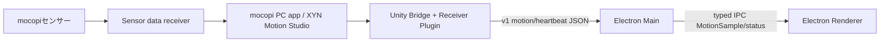

# docs/requirements.md

発勁ラボブレイカーの実装要件です。元要件定義書が別途存在する場合でも、このリポジトリ内で実装・型・テスト契約を判断するときは、本ファイルと `SPEC.md` を突き合わせて確認します。

## 1. 固定前提

- 本体アプリはElectron / TypeScript / HTML / CSSで作る。
- mocopi入力はUnity Bridge + mocopi Receiver Plugin for Unityを使う。
- Electronはmocopi生UDPを解析しない。
- Unity BridgeはRightHand Transformをv1 JSONとして `127.0.0.1:45100` へ送る。
- Keyboard入力は開発・予備・発表トラブル時のために残す。

## 2. 2026-06-06 確定技術要件

| 領域 | 要件 |
|---|---|
| Main / Renderer | `MotionSample`、filter、速度、加速度、validityはElectron Main生成。Renderer再計算禁止 |
| Mock | `mock-unity-bridge` は独立source/mode。Unity実入力Gateを代替しない |
| score | `validForScore=true` のsampleだけを使う |
| Calibration | `validForCalibration=true` のsampleだけを使い、discard 300ms、neutral 2秒、forward 1秒、forward距離0.15m以上 |
| Hakkei timeout | no-impact。`hakkeiDetected=false`、`hakkeiTimedOut=true`、`hakkeiScore=0` |
| config | `schemaVersion`、`coordinates`、`keyboard`、`rankThresholds`、`maxDatagramBytes` をschemaと例の両方に含める |
| Gate | Gate B2/D1は実Unity Bridge必須。D2はKeyboard fallbackとして別扱い |

## 3. 標準データ経路



## 4. v1 JSON必須field

```json
{
  "protocolVersion": 1,
  "type": "motion",
  "sessionId": "unity-20260606-001",
  "seq": 1,
  "timestampMs": 33,
  "source": "unity-bridge",
  "isTracked": true,
  "rightHand": { "x": 0.1, "y": 1.2, "z": 0.3 },
  "avatar": { "isHuman": true, "hasRightHand": true, "forward": { "x": 0, "y": 0, "z": 1 } }
}
```

```json
{
  "protocolVersion": 1,
  "type": "heartbeat",
  "sessionId": "unity-20260606-001",
  "timestampMs": 33,
  "source": "unity-bridge",
  "receiverReady": true,
  "receiverStatus": "receiving",
  "avatarReady": true,
  "rightHandReady": true,
  "frameRate": 50,
  "sendRateHz": 30
}
```

## 5. Gate要件

- Gate A: Keyboard modeでMain生成 `MotionSample` を通り、10回連続でTitleからResultまで完走する。
- Gate B1: Unity Bridge単体でRightHand、v1 common field、heartbeat readinessが確認できる。
- Gate B2: 実Unity BridgeでInputCheck OK。Mockだけでは不可。
- Gate C: 実Unity入力でCalibration、上下/前後チャージ、動画選択が成立する。
- Gate D1: 実Unity入力でmotionHz、heartbeatHz、phase別validSampleRatio、2秒jitter、静止誤検出0、実play成立がすべてPASS。
- Gate D2: Keyboard fallback承認。Gate D1通過扱いにはしない。
